# Lecture 1
## Life of data

### Data sources
* External data sources
* Operational database
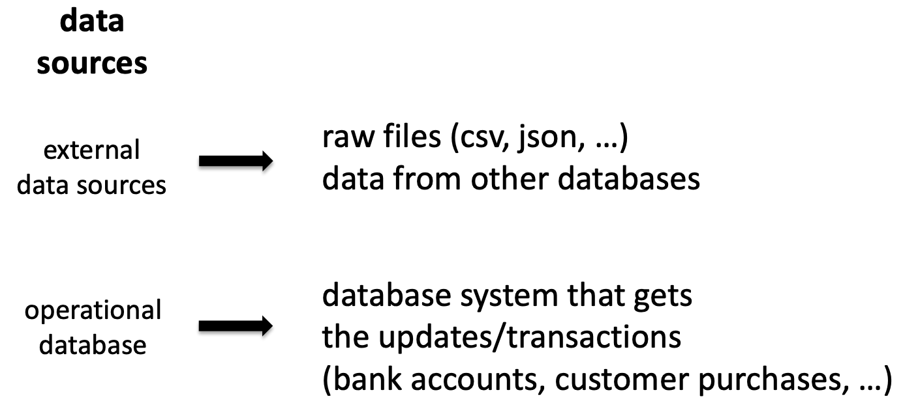

### Data movement
* Extract load
* Complex event processing
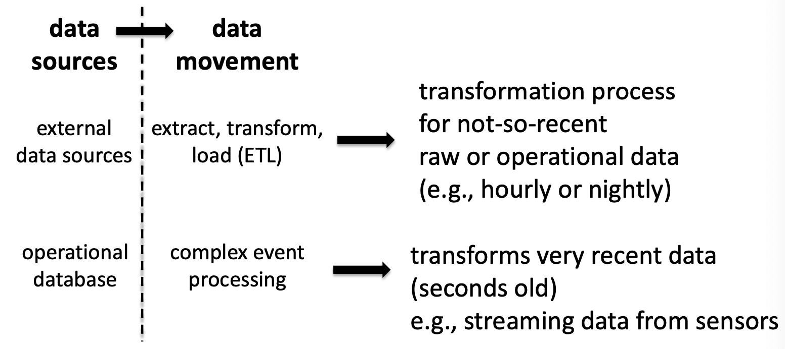

### Data warehouse
* Relational database systems
* Dataflow engine
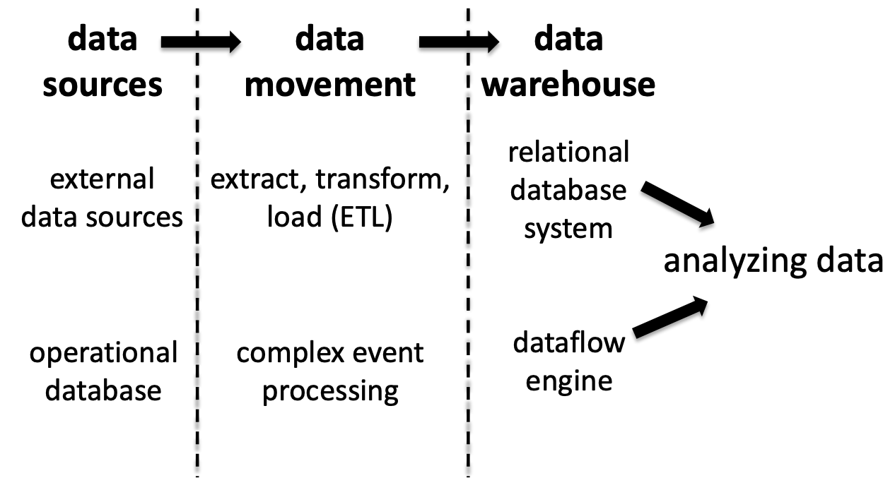

### Specialized data systems
* Serve specialized business needs
* Online analytical processing
* Data mining
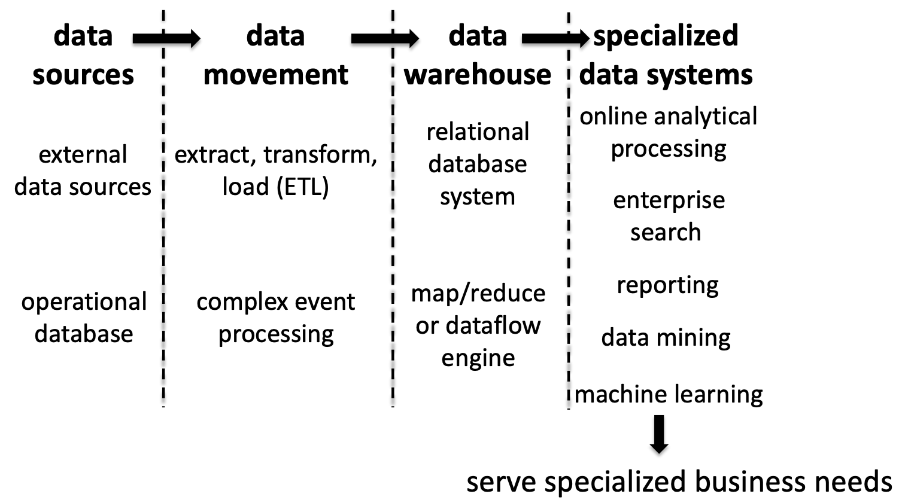

### Front end
* Dashboards - for decision making
* Spreadsheet
* Search
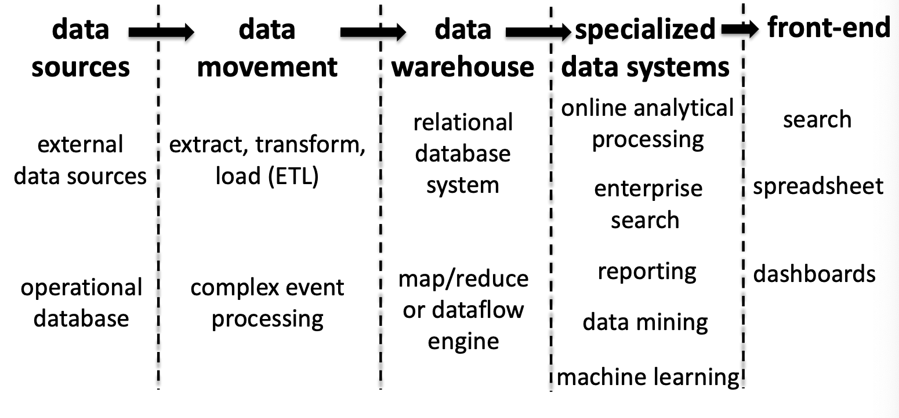

### OLTP Transaction processing 
* Mainly happens at the **operational database**
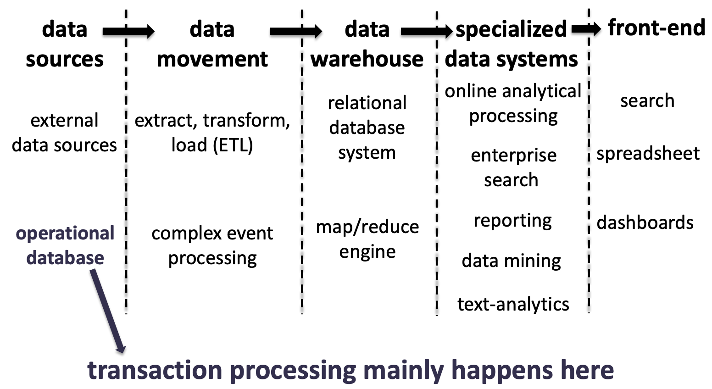

## What is transaction processing?
> Information processing done at the granularity of *transactions*

> *What is transaction?*
> 
> "an indivisible unit of work (a sequence of read & write operations) that **either successfully completes or fails as a whole**"

### Transaction vs. analytical processing
Transaction processing - Online transactional processing (OLTP)
* short-running simple requests 
* access small portion of the data 
* fetch several columns of a record 
* lookup, insert, delete, update.
* Example: deposit money to a customer’s account, lookup information about a product, …
* > **Rely on indexes!**, since we only need small portion of the data.

Analytical processing - online analytical processing (OLAP)
* long-running complex requests 
* access lots of data
* fetch a few columns of a record
* SQL queries, map-reduce jobs, machine learning, graph analytics,…
* Example: customers who are most likely to get mortgages next year, item sold the most last year in each department of a store grouped by months, …

> Required functionality & optimizations differ

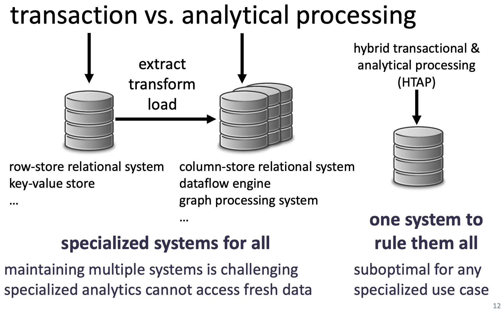

#### Specialized systems for all
* maintaining multiple systems is challenging
* specialized analytics cannot access fresh data

OLTP:
* row-store relational system 
* key-value store

OLAP:
* column-store relational system 
* dataflow engine
* graph processing system

#### One system to rule them all
* suboptimal for any specialized use case
HTAP:  (hybrid transactional & analytical processing)

## Why do we need transactions?
* many concurrent requests
  * from different applications
  * from several users in the same application

> DBMS must ensure reliable operations over shared data despite many concurrent accesses

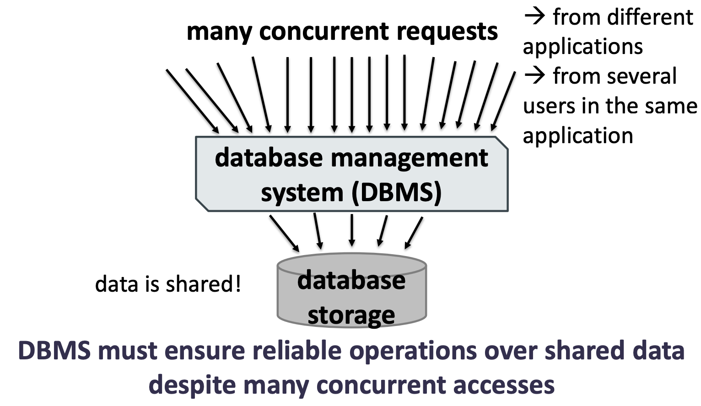

> With many concurrent request
> * **Anything can crash!!!**
> 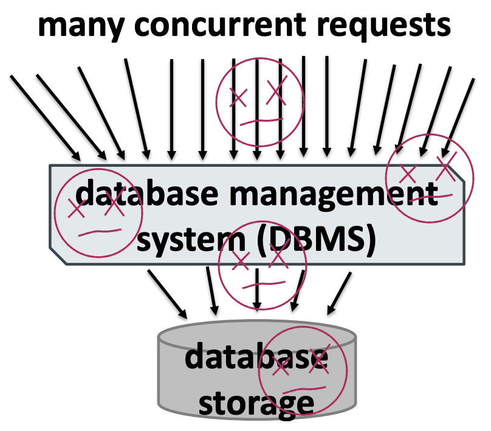
> DBMS must be resilient despite many potential system failures

> to the end user everything looks fine, thanks to transactions!
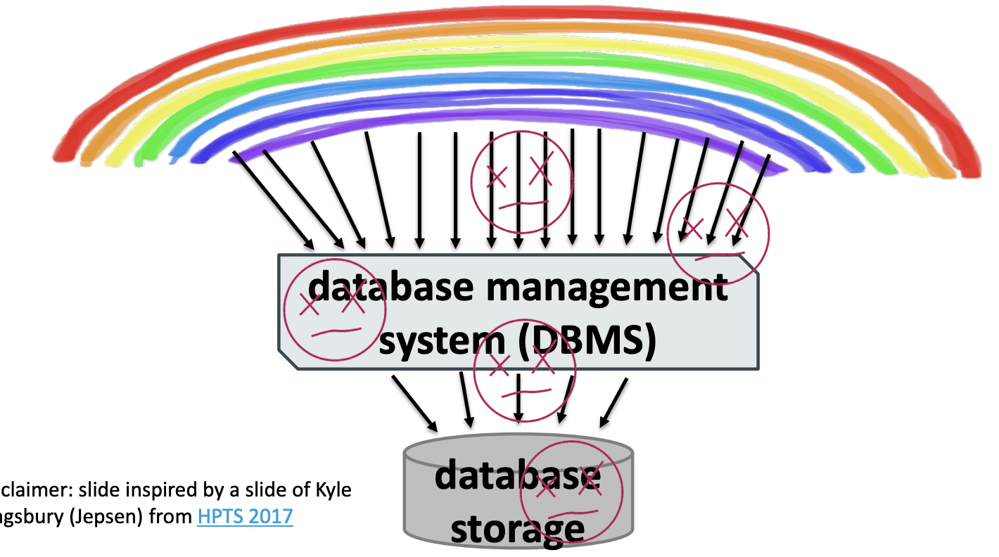

## ACID
* Atomicity
  * either all or none of the actions in a transaction happen
* Consistency
  * a transaction transforms a DBMS from one consistent state to another
* Isolation
  * actions of one transaction is isolated from the actions of other transactions
* Durability
  * if a transaction ends successfully, its effects persist
  
> transactions in a DBMS follow ACID properties

### Transaction example
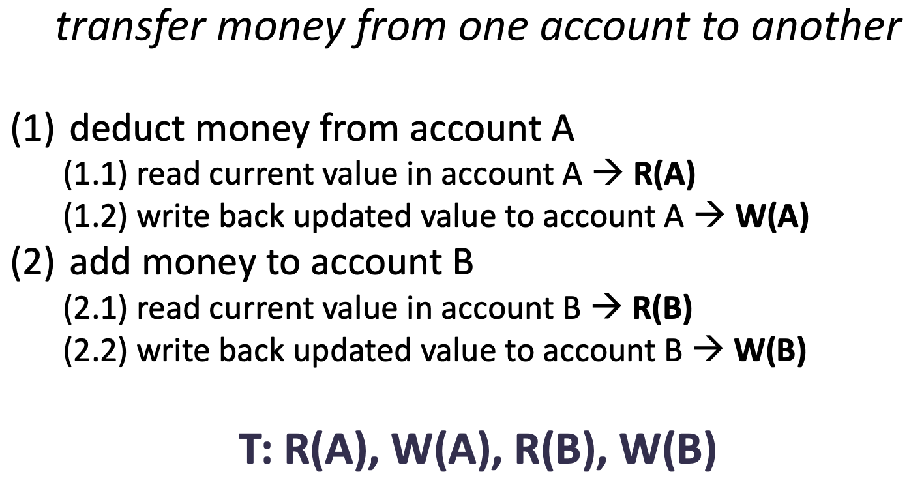

#### Atomicity (all oor nothing)
* possible outcomes of executing a transaction
  * commit after completing all its actions
  * abort after executing some actions
> **user should not worry about partial executions**
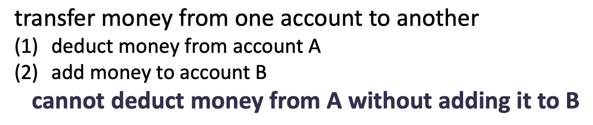

Examples:
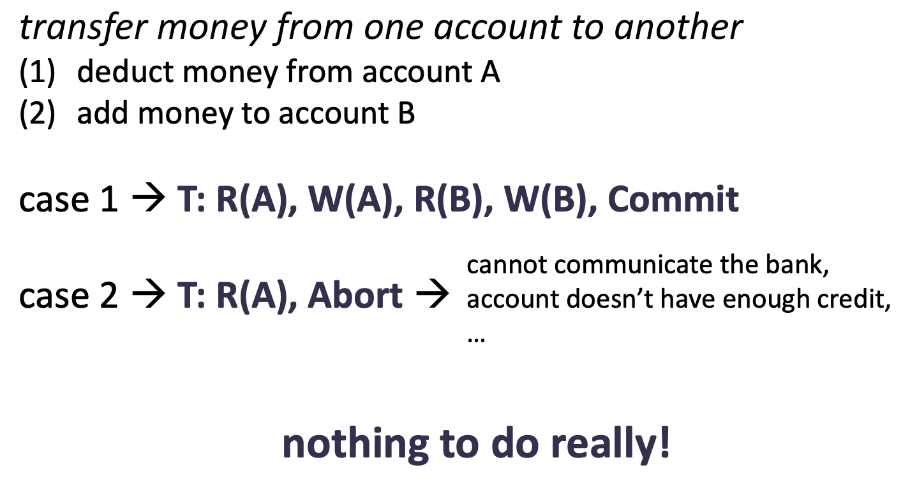

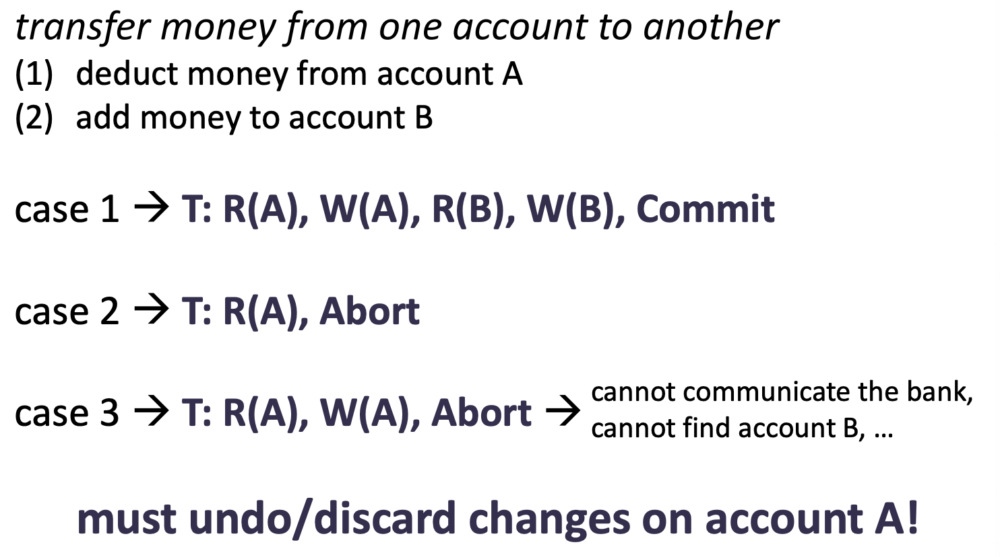

How to ensure atomicity?
* **Logging** -> cheaper commits
  * modify data in-place (= modify the original)
  * log all actions that modify data in a transaction
  * if transaction commits, nothing to do
  * if transaction aborts, rollback/undo all modifications
  * can also be used for durability, archiving, audit trail, etc
* **Shadow pages** -> cheaper aborts
  * avoid in-place updates
  * have a copy of the data, update the copy
  * before transaction commits, replace original with modified copy
  * if transaction aborts, just discard the copy

> choice depends on application needs...

#### Consistency
* Data should make sense
* in practice, consistency is about ensuring integrity constraints
  * if transaction breaks constraints, abort it
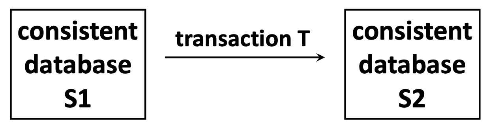
> Note in concurrency, consistency has a different meaning which more similar to atomicity! **In ACID it is different!**

Example: 
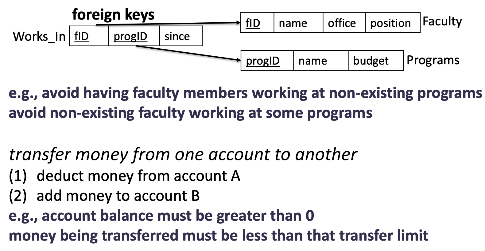

#### Isolation
* act like no one else is around
* each transaction executes as if no other
* transaction is executing concurrently
* 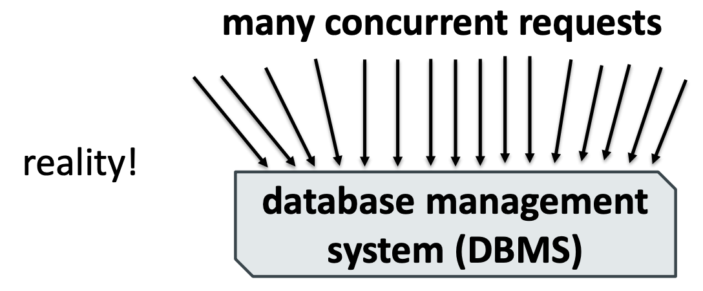

> ensured by a **serializable schedule** for transactions the final effect of executing transactions should be identical to executing them **in some serial order**

Example:
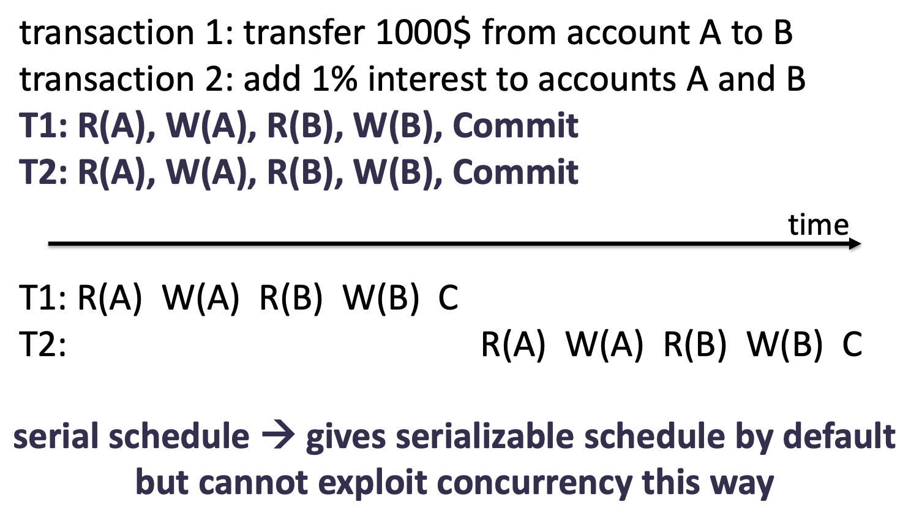

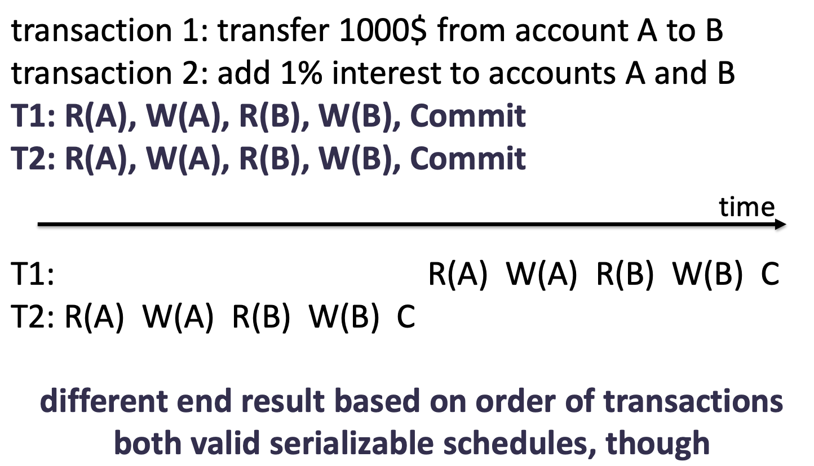

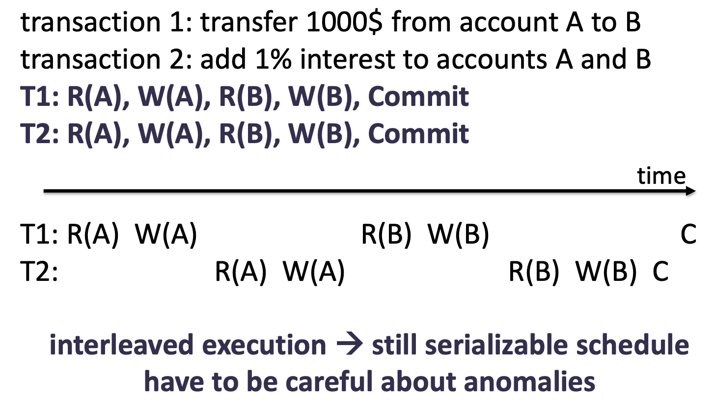

How to ensure isolation?
* requires serializable schedule  hard to enforce
* many anomalies possible when transaction schedules interleave due to concurrency
* not all anomalies break serializability, but they have the potential to do so
* we need **concurrency control**

##### Concurrency control
* Pessimistic:
  * prevent problems before they arise (like using locks)
  * better when conflicting data accesses are frequent
* Optimistic:
  * deal with problems after they happen
  * better when conflicting data accesses are rare

**Strict 2-phase locking (strict 2PL)**
* most common for **traditional** relational database systems
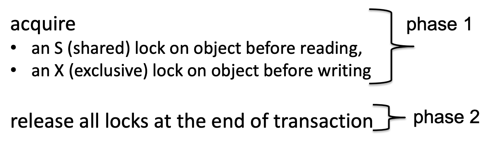

##### Isolation levels in modern systems
Ensures "isolation" in ACID always
* **Serializable**
  * ensures serializable schedule with no anomalies

May vviolate "isolation" in ACID
* **READ UNCOMMITTED**
  * a transaction can read uncommitted changes
* **READ COMMITTED**
  * a transaction only reads committed data, some other transaction may overwrite this data
* **REPEATABLE READ**
  * a transaction only reads committed data, other transactions cannot overwrite this data, but phantoms are possible

#### Durability
* Do not loose data
* Handles recovery from crashes / failures

Ensured by **write-ahead logging**
* each transaction logs all actions that modify data in a transaction -> log record per action
* these log records must be flushed to disk (=persisted) before transaction commits
* the log record for a modified database page, must be flushed to disk before that page
* also used for *atomicity*

### In short
* **Atomicity**: All or nothing
* **Consistency**: Data should make sense
* **Isolation**: Act like no one is around
* **Durability**: Do not loose data