# Data bottlenecks in ML pipelines

Evolutioon of language model training from 2017 - today:

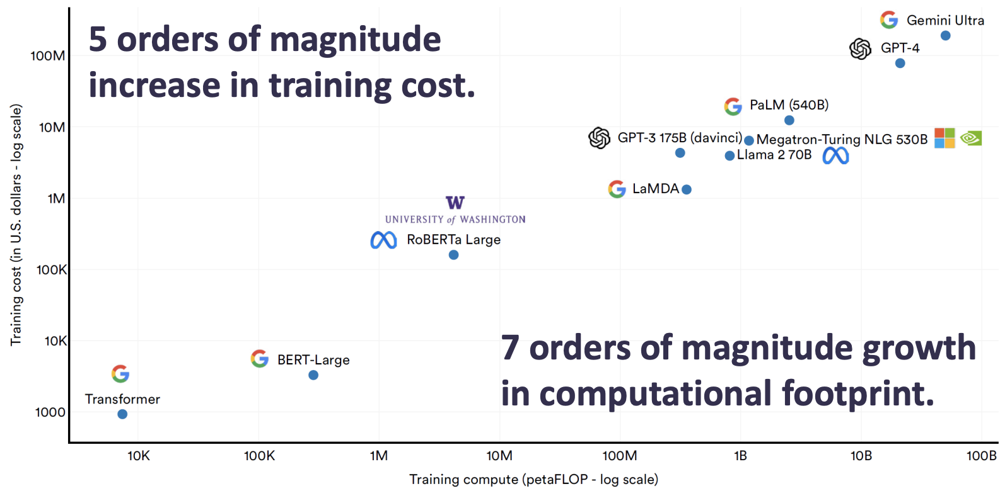

> x-axis: 7 orders of magnitude growth in computational footprint.
> y-axis: 5 orders of magnitude increase in training cost.

## Deep learning hardware
The cost is based on the hardware (CPU, GPU) we use. For the computational demand.
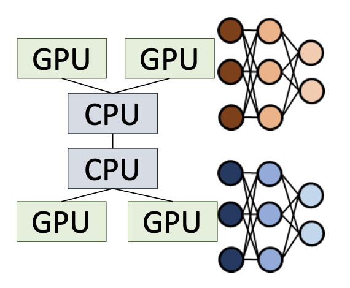

### CPU vs GPU

Central processing unit:
* several (complex) cores (allow parallel computation)
* good for latency-oriented tasks & single-core performance
  * throughput- vs latency-oriented designs exist among CPUs as well.

Graphics processing unit:
* many (simple) cores
* good for throughput-oriented & embarrassingly parallel tasks
* good for deep learning
  * e.g., large matrix operations

### Deep learning hardware
GPUs:

Tensorflow processing unit (TPU)s:
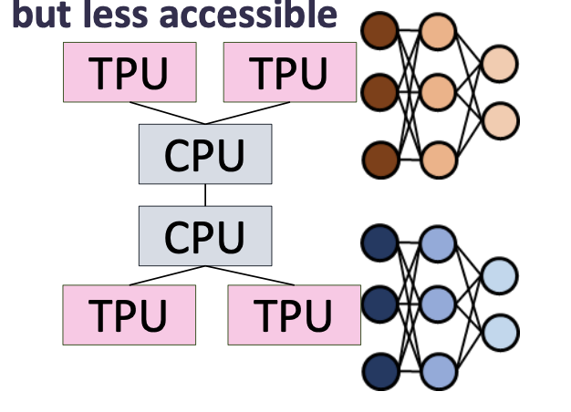
* tend to be more efficient
* but less accessible
* costs & progress depend on the performance & utilization of the available hardware.

> We cannot buy them for ourselfs. 

### NVIDIA GPUs (2012-2023)
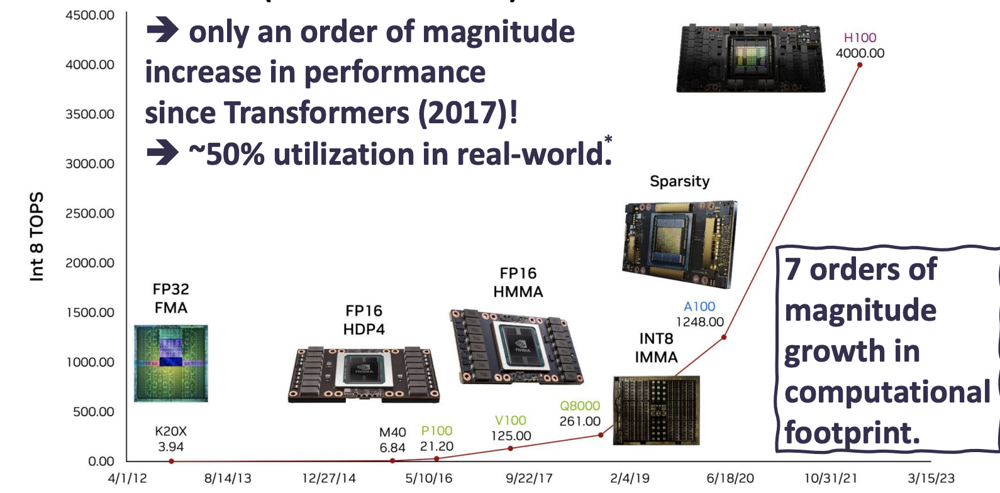

> In practice, we need to deploy more hardware to get to the computatioonal requirements. 
> Also for big data centers, we have much larger dataset to train models on, and will need a lot of data, requiring us to deploy more hardware.

## Journey of data in deep learning training
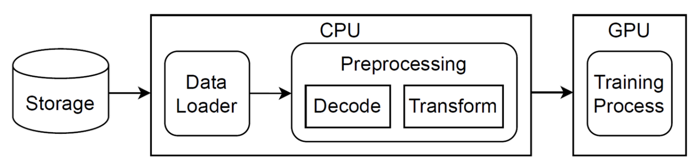

CPU feeds the GPU
* 16-64 CPU cores per GPU (recommended)
* 96 CPU cores per TPU*
* otherwise, GPU/TPU may be underutilized

**Can we do more with fewer CPUs & less of the CPU?**
Reducing the CPU needs for deep learning:
* Data and work sharing
* Multiple model training on the same data
* Use cases
  * Hyper-parameter tuning
  * neural architecture search

Redundant work & CPU use!
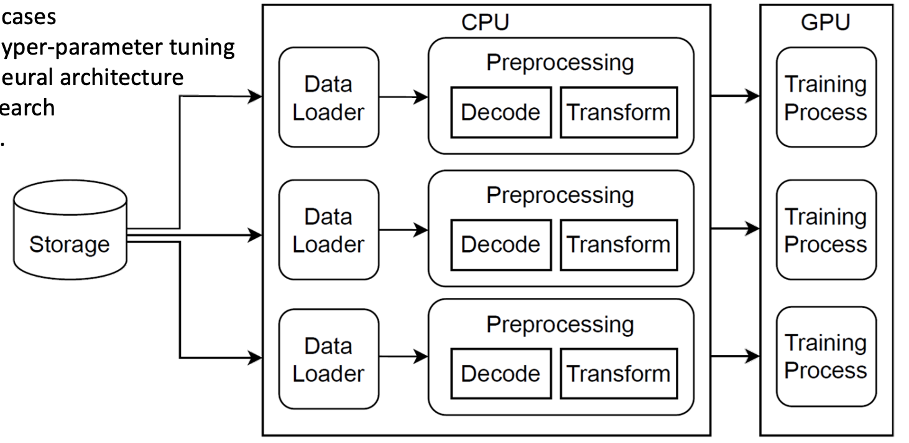

### How to minimize the redundancy
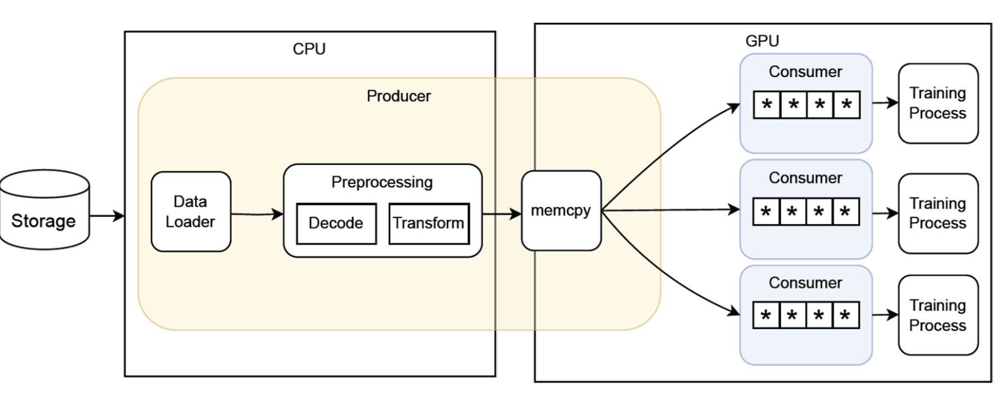

### Reducing the CPU needs for deep learning
**Data & work sharing**
* E.g. tf.data service
* Pros:
  * eliminates redundant work & helps with cost savings 
* Cons: 
  * needs enough similar training processes to share effectively

**Data pre-processing on the accelerator (e.g., GPU/TPU)**
* E.g., DALI (NVIDIA), FusionFlow
* Pros:
  * accelerator’s processing power is used for data pre-processing
* Cons:
   * Not every task is extremely parallel processing (e.g., string manipulation)
   * We need the accelerator for actual training
  
> What are the trade-offs of different options?
> * GPU-centric I/O path
> * Is it possible to have an I/O path that is more centered towards better usage for accelerator's

## GPU-centric I/O path
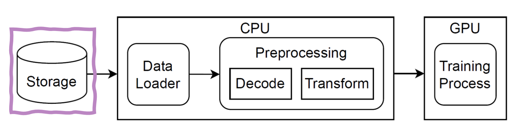

Example:
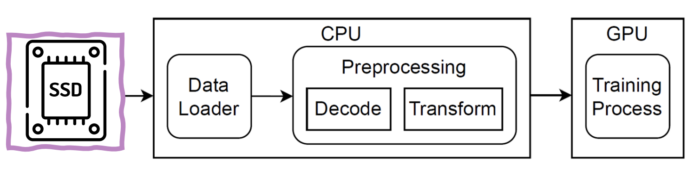

Hardware setup:
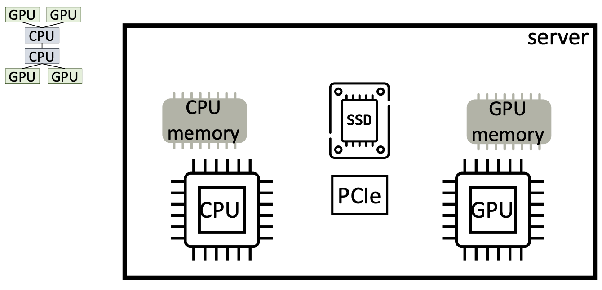
* Connected with PCIe

### Conventional CPU centric
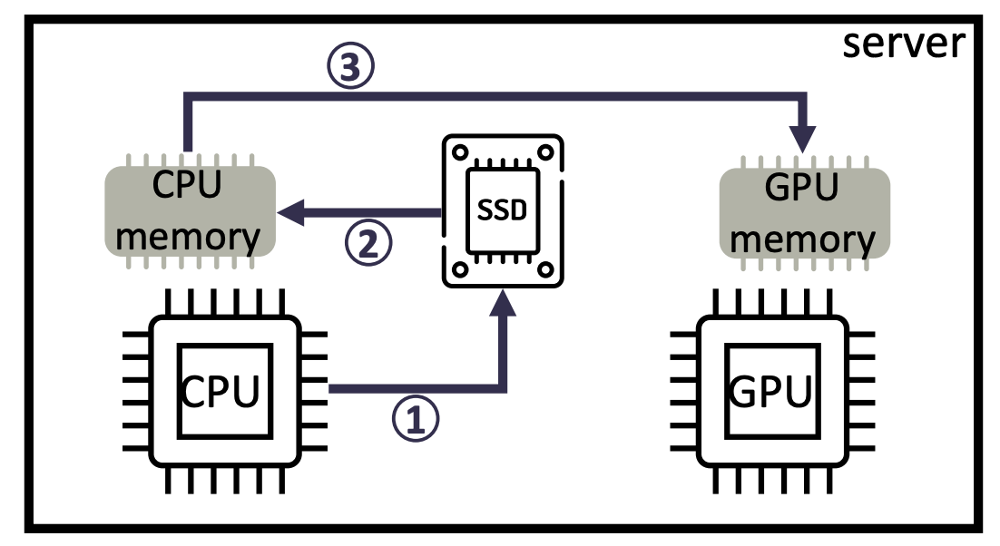

Pro:
* ecosystem support
Cons:
* CPU-bound & overhead from memory copy

### GPUfs & ActivePointers: GPU-centric & GPU-initiated I/O
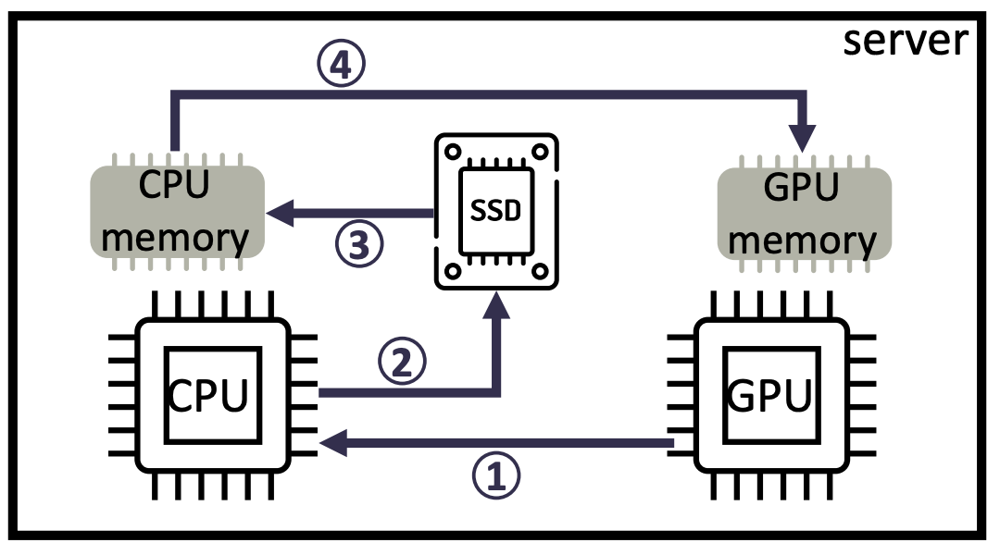
Pros:
* improves programmability, for people programming code on the GPU. Since from the GPU you can activate IO calls. 
Cons:
* longer I/O path, slight performance impact

### GDS: GPU-centric & CPU-initiated
> GPU Direct Storage
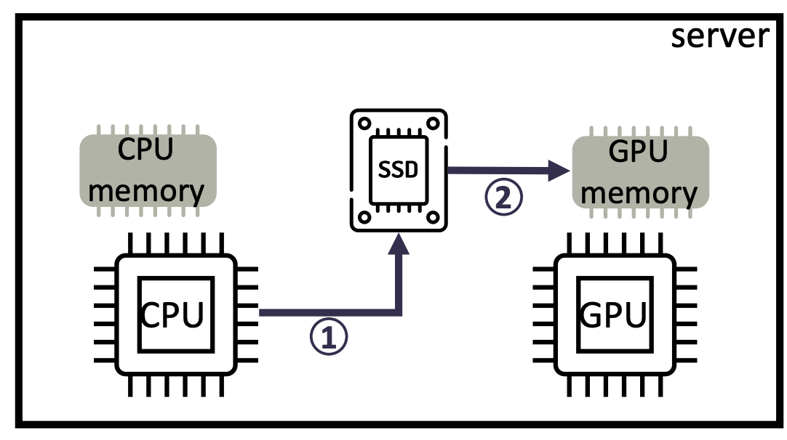

Pros:
* Eliminates the extra memory copy
Cons:
* Still CPU-bound

### BaM: GPU-centric & GPU-initiated
> Big accelerator memory
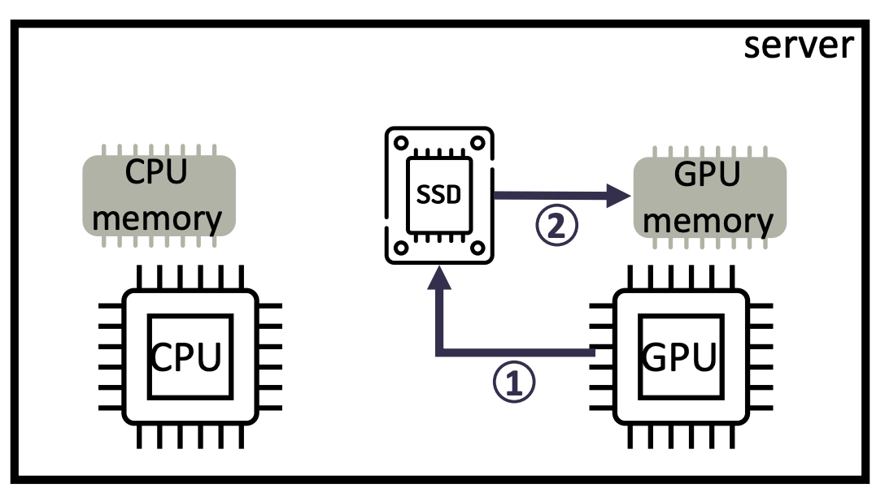
Pros:
* eliminates the CPU on the path
Cons:
* ecosystem missing & saturates GPU

### GMT: GPU-centric & CPU- & GPU-initiated
> GPU Orchestrated Memory Tiering
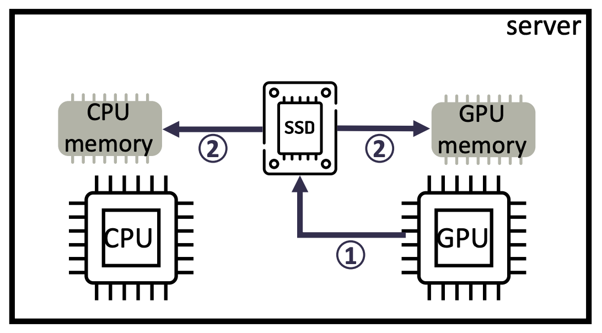

Pros:
* hybrid approach, works well if data reuse is high
Cons:
* extra CPU/GPU resources used

### CPU- vs GPU-centric storage access
* **mechanisms**: CPU-centric: SPDK & GPU-centric: GDS, BaM
* **workload**: random reads
  * each mechanism has their own tool for benchmarking
* **hardware**:
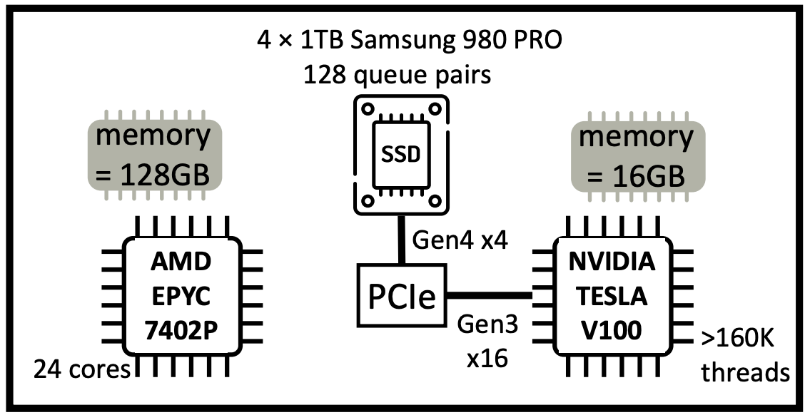

## Bandwidth utilization – 4 SSDs & PCIe

GDS is CPU-compute heavy.
* 16 logical cores utilized

BaM is limited by the PCIe Gen3 link & heavy on the GPU resources.
* whole GPU utilized

CPU-centric SPDK is resource-efficient but has a longer path to the GPU.
* 2 logical cores utilized

> We see a drop from 4KiB to 8 KiB, this is because that the OS by default use 4 KiB, hence it does not fit the filesystem and going to 8 KiB the OS will become a bottleneck. 

## Summary - Reducing the CPU needs for deep learning
**Data & work sharing**
* Pro: 
  * eliminates redundant work & helps with cost savings
* Cons:
  * needs enough similar training processes to share effectively

**Data pre-processing on the accelerator (e.g., GPU/TPU)**
* Pro:
  * accelerator’s processing power is used for data pre-processing
* Cons:
  * not every task is extremely parallel processing (e.g., string manipulation)
  * we need the accelerator for actual training

**GPU-centric I/O path**
* Pro:
  * reduced CPU involvement on the I/O path
* Cons:
  * ecosystem needs to mature for wider-scale adoption
  * still heavy either on the CPU or GPU