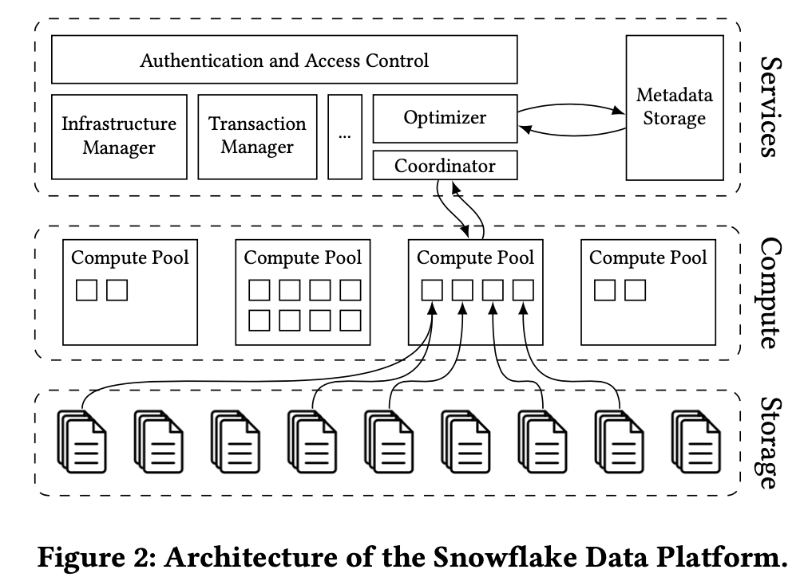

# Pruning in Snowflake
## Resume of the paper
**Goal**:
* The paper’s main objective is to evaluate the effectiveness of pruning in Snowflake’s query processing.
* It examines how Snowflake applies partition pruning and metadata filtering to reduce the amount of scanned data.
* It also looks into how pruning improves query performance while maintaining correctness.

**Findings**

1. **High Selectivity in Real-World Queries**
   * Analytical queries on Snowflake are typically **more selective** than synthetic benchmarks assume.
   * This high selectivity allows pruning to skip huge portions of data efficiently
2. **Effectiveness of Different Pruning Techniques**
   * **Filter pruning**: Skips ~99% of partitions for many queries, and sometimes eliminates entire scans.
   * **LIMIT pruning**: Rarely applicable, but when conditions are met it can cut scans down to a single partition.
   * **Top-k pruning**: Achieves ~77% pruning on average, significantly improving runtimes.
   * **Join pruning**: Very effective, cutting probe-side scan sets by up to 99.99% in some cases
3. **Combined Impact**
   * Across all Snowflake workloads, pruning techniques together result in **99.4% of micro-partitions** being skipped.
   * This demonstrates pruning as a **key enabler** of performance in cloud-based analytics.
4. **Benchmarks vs. Reality**
   * Standard benchmarks like **TPC-H** severely underestimate pruning’s importance.
   * In real workloads, pruning has far more impact because queries tend to be more selective and diverse
5. **Applicability Beyond Snowflake**
   * Techniques are not limited to Snowflake’s proprietary format — they also apply to open formats like Apache Iceberg with Parquet
  
>In short: the study finds that pruning is **far more effective in real-world cloud analytics workloads than previously recognized**, and that **novel pruning extensions (LIMIT, top-k, join pruning)** significantly expand opportunities for optimization.

**Strengths**
* **Clarity**: The paper clearly explains how pruning works in Snowflake and provides structured experimental results .

* **Practical relevance**: Focuses on a real-world cloud data warehouse, not just theory.

* **Comparative insights**: Shows pruning’s impact on execution time and scanned data, making benefits tangible.

* **Novelty**: While pruning is not a new concept, the paper positions it in the context of Snowflake’s architecture, which is relatively underexplored in research.

**Weaknesses**
* **Limited scope**: The evaluation focuses only on a subset of queries and scenarios. Broader workloads and real-world benchmarks are not extensively covered.

* **Lack of deep technical detail**: The implementation specifics of Snowflake’s pruning mechanisms remain somewhat opaque due to Snowflake’s proprietary nature.

* **Performance trade-offs**: While improvements are measured, the paper doesn’t fully explore cases where pruning may fail or provide negligible benefit.

* **Generality**: Findings are specific to Snowflake, so transferability to other systems is limited.

## Abstract

* **Presents the motivation**: cloud data warehouses must process **petabytes of data** efficiently.

* Traditional partition pruning is extended with new techniques (LIMIT, top-k, join pruning).

* **Findings**: Snowflake skips 99.4% of micro-partitions on production workloads, far more than benchmarks suggest.

## Introduction

* Argues that the fastest way to process data is not to process it at all → pruning.

* In cloud systems, pruning also saves **network I/O** (not just disk reads).

* Snowflake achieves very high pruning rates (99.4%).

* States contributions: analyzing pruning techniques (filter, LIMIT, top-k, join), proposing new ones, and evaluating them on real workloads.

## Architecture of Snowflake

* Overview of Snowflake’s **decoupled compute + storage** design.

* Data is stored in **micro-partitions** with metadata (min/max values).

* Explains **compile-time pruning** (done early, helps optimizer) vs. **runtime pruning** (done during execution, more dynamic).

* **Summarizes benefits**: faster scans, better query plans, smaller data transfers.

## Filter Pruning

* The “classic” pruning technique: use predicates + min/max metadata to exclude partitions.

* Extends pruning to **complex expressions** (functions, LIKE filters).

* Introduces **filter reordering** (prioritize fast/selective filters) and **cutoff** (skip ineffective filters).

* **Findings**: ~36% of queries prune >90% of partitions; ~27% get no benefit due to poor data distribution.

## LIMIT Pruning

* LIMIT queries are common in BI and exploration.

* Proposes identifying **fully-matching partitions** (all rows satisfy predicates).

* If enough rows are found in these, only those partitions are scanned.

* **Results**: rarely applicable but **dramatic reduction** (down to 1 partition) when conditions hold.

## Top-k Pruning

* Applies to queries with `ORDER BY ... LIMIT k`.

* Inspired by **information retrieval algorithms** (Threshold, WAND).

* Uses evolving **boundary values** from the heap to skip partitions.

* Sorting micro-partitions by max-values improves pruning.

* **Findings**: avg. pruning ratio ~77%; runtime improvements >99.9% in some cases.

## Join Pruning

* Targets **hash joins**, which are expensive.

* Summarizes **build-side values** (e.g., via Bloom filters or summaries).

* Skips probe-side partitions whose min/max ranges don’t overlap.

* **Findings**: ~79% of probe-side partitions pruned; some queries see 100% pruning (probe-side scan avoided).

## The Pruning Flow in Snowflake
* Most queries benefit from **at least filter pruning**.

## Discussion

* **Iceberg & Parquet support**: pruning techniques apply equally to open formats.

* **Predicate caching**: could complement pruning but less effective for dynamic/ad-hoc queries.

* **Benchmarks vs. reality**: TPC-H underestimates pruning (avg. pruning ratio only ~28.7% vs. >90% in real workloads).

* Calls for more realistic benchmarks with selective queries, LIMITs, and join opportunities.

## Conclusion

* Pruning is critical for query performance in Snowflake and cloud warehouses.

* Techniques achieve very high pruning ratios:
   * Filter: ~99%
   * LIMIT: ~70%
   * Top-k: ~77%
   * Join: ~79%
* Overall: **99.4% of partitions** skipped in Snowflake workloads.

* **Future work**: better benchmarks, more pruning-aware optimizations.

# AutoComp Automated Data Compaction for Log-Structured Tables in Data Lakes

## Resume of the Paper
**Goal**:
* The paper introduces **AutoComp**, a framework designed to automatically compare multiple AutoML frameworks. Its objective is to reduce the burden of manual experimentation by offering a unified, standardized, and automated way to evaluate AutoML tools across datasets, metrics, and tasks.

**Findings**:

* AutoComp provides **reproducible and standardized benchmarking** of AutoML frameworks.

* It highlights **differences in performance, efficiency, and usability** between AutoML tools.

* Experiments confirm that AutoComp can **reliably identify strengths and weaknesses** of different AutoML frameworks on varied datasets.

* The system is shown to be **scalable and adaptable** for new datasets and frameworks.

## Strong Points

* **Novelty & Contribution**: First framework to automate large-scale comparison of AutoML tools in a systematic way.

* **Reproducibility**: Ensures results are consistent and comparable across different studies.

* **Flexibility**: Easily extensible to new datasets and AutoML frameworks.

* **Scalability**: Demonstrated ability to handle multiple datasets and frameworks without manual intervention.

* **Practical Value**: Helps practitioners quickly decide which AutoML framework is best suited for their problem.

## Weak Points

* **Dataset Bias**: Results may depend heavily on the selected benchmark datasets. If datasets lack diversity, findings may not generalize.

* **Metric Selection**: Limited to certain evaluation metrics; different tasks may require alternative measures.

* **Framework Coverage**: Only includes a subset of existing AutoML frameworks, so conclusions may not cover the full landscape.

* **Interpretability**: While performance is compared, little is said about the interpretability or transparency of models produced by different frameworks.

* **Computational Cost**: Running large-scale automated comparisons can be resource-intensive.

## Context and Background
>This paper was published in 2025

**Maturity of Data Lakes & LSTs**:
* By 2025, data lakes have fully evolved from “cheap storage for raw data” into the **default enterprise data management backbone.**
* Log-Structured Tables (Iceberg, Delta Lake, Hudi) are now standard for **transactional consistency and schema evolution** on top of object stores.
* This makes their limitations (like small file proliferation) even more critical since they underpin analytics, ML pipelines, and AI workloads.

**Scale of Industry Deployments**:
* Companies like LinkedIn, Microsoft, and others manage **tens of thousands of tables** in production data lakes.
* Manually managing compaction at that scale is impossible → demand for **automation frameworks** is high.
* Cloud cost pressures in 2025 (due to storage I/O pricing models) make **efficient compaction** **financially important**, not just technical.

**Research–Industry Convergence**:
* This paper is co-authored by researchers (UMD) and engineers (LinkedIn, Microsoft), reflecting the tight integration of academia & industry in modern data systems research.
* It blends real-world deployment lessons with system design, showing that **compaction is not just an algorithmic problem but also an operational one**.

**Shift to Automation & Optimization**: 

* Broader trend in 2025: **automation of infrastructure decisions** (e.g., AutoML for models, AutoIndexing in databases, AutoScaling in cloud systems).
* AutoComp fits this wave → an “Auto” system for **data layout optimization**.
* It’s positioned as a **foundation for future extensions**, not just a point solution.

## Abstract
**Problem**: Data lakes often suffer from small file proliferation due to append-only write patterns in log-structured tables (Delta Lake, Iceberg, Hudi).

**Consequences**: Poor query performance, high storage costs, metadata bloat, and system bottlenecks.

**Solution**: Propose AutoComp, a scalable and extensible automatic compaction framework.

**Evaluation**: Benchmarks + deployment at LinkedIn show significant improvements in file count reduction and query performance.

## Introduction
* Data lakes evolved into the standard for enterprise storage.

* Log-structured tables (LSTs) became critical to provide ACID-like guarantees.

* However, they generate many small files due to trickle writes, CDC, and updates.

* **Small files cause inefficiency**: high RPC traffic, metadata growth, poor compression.

* Manual compaction strategies exist but are **ad-hoc and non-scalable**.

* **Goal**: Build an automatic, scalable compaction solution → AutoComp.

## Motivating Scenario (LinkedIn Case Study)

* LinkedIn uses Iceberg with OpenHouse (control plane).

* Ingestion pipeline produces well-sized files (~512 MB).

* End-user jobs (Spark, Flink, Trino) produce **lots of small files**.

* Causes: inserts, CDC, CoW vs MoR deletions, migration from older formats, metadata overhead.

* Impacts: degraded query performance, storage inefficiency, HDFS NameNode overload.

* Manual compaction fixed issues but was not scalable → led to AutoComp development.

## AutoComp Overview

**Functional requirements**:
* FR1: Fine-grained work units (partition-level, snapshot-level).

* FR2: Support multiple compaction strategies (benefit-based, cost-aware).

* FR3: Periodic & post-write execution triggers.

**Non-functional requirements**:

* Extensibility (plug-in strategies).

* Explainability (deterministic decision-making).

* Cross-platform compatibility (Iceberg, Delta Lake, Hudi).

**Framework workflow (OODA loop)**: Observe → Orient → Decide → Act.

* Extract statistics → compute traits (e.g., file entropy, cost) → rank candidates → schedule compaction.

## Implementation Details

**Candidate generation & filtering**: 
* Select tables/partitions/snapshots to compact.

**Trait generation**:

* File count reduction (benefit).

* Compute cost (resources required).

**Ranking candidates**:

* Unconstrained: greedy threshold-based triggers.

* Constrained: multi-objective optimization (balance benefit vs cost).

**Scheduling**: 
* Can run on same or separate cluster, sequential vs parallel jobs.

## Automatic Compaction Execution

Two strategies:

* **Optimize-after-write**: trigger compaction right after writes.

* **Periodic compaction**: run on schedule (e.g., daily).

Can be push-based (engine hooks) or pull-based (independent service).

Integrated with LinkedIn’s OpenHouse cluster.

## Evaluation (Synthetic Benchmarks)

**Setup**: Spark + Iceberg + Azure cluster with synthetic workloads (CAB-gen, TPC-H, TPC-DS).

**Metrics**: File count, GBHr (compute cost), query latency.

**Findings**:

* AutoComp reduces file count steadily (vs baseline where small files grow).

* Query performance improved (up to 1.53× faster with compaction).

* Hybrid compaction (partition + table) gives balanced performance-cost trade-off.

* Conflicts: table-level compaction more prone to write conflicts than partition-level.

* Auto-tuning triggers (via FLAML) show workload-specific benefits.

## AutoComp in Practice (LinkedIn Deployment)

Initial manual compaction (top-100 tables daily) → diminishing returns.

AutoComp → smarter selection, higher impact even with fewer tables.

Example: manual compaction reduced ~6.6M files; **AutoComp reduced ~7.4M files with 10× fewer tables**.

Reduced HDFS metadata overhead (RPCs, open() calls).

Improved query latency & workload stability.

Some model prediction mismatches (e.g., over/under-estimating costs).

## Discussion & Future Directions

* **Multi-objective trade-offs**: current weighted-sum ranking may overweight one objective; suggest Pareto frontier optimization.

* **Conflict resolution**: need better prediction & handling of compaction conflicts.

* **Beyond compaction**: integrate clustering (Z-ordering, V-ordering) for layout optimization.

* **Workload-aware compaction**: incorporate query patterns into decisions.

* **Tuning policies**: write engines (e.g., Spark AQE) may worsen small-file problem; control planes can help recommend fixes.

* **Auto-tuning challenge**: expensive to run iteratively; need lighter optimizers.

## Conclusion

AutoComp addresses small file proliferation with a **scalable, automatic, multi-objective** compaction system.

Shown to improve **storage efficiency, query performance, and system stability** at LinkedIn.

Provides foundation for **future extensions** (layout optimization, workload-awareness, Pareto trade-offs).

## Keywords
* **Log-Structured Tables** (LSTs): are table formats for data lakes (like Apache Iceberg, Delta Lake, and Apache Hudi) that:
   * Store data as **immutable files** (usually in open **columnar** formats like Parquet or ORC).
   * Maintain a **metadata/log layer** that tracks table versions, schemas, and statistics.
   * Use an **append-only model**: every write (insert, update, delete) adds new files and updates metadata, rather than modifying existing files.
* **Bloat**: database bloat can become a significant issue over time. Bloat refers to the unused or fragmented space in database tables and indexes. This unused space can degrade database performance, increase storage costs, and slow down query execution. **File count explodes → metadata size explodes**.
* **CDC**: Change data capture (CDC) refers to the process of identifying and capturing changes made to data in a database and then delivering those changes in real-time to a downstream process or system.
* **RPC**: Remote Procedure Call (RPC) is typically used to call remote functions on a server that require an action result
* **CoW**: Copy-on-write (COW), also called implicit sharing or shadowing,is a resource-management technique used in programming to manage shared data efficiently.
* **MoR**: Merge-on-Read
* **HDFS**: Hadoop Distributed File System. HDFS operates as a distributed file system designed to run on commodity hardware. HDFS is fault-tolerant and designed to be deployed on low-cost, commodity hardware.
* **OpenHouse cluster**: an open-source control plane designed for efficient management of tables within open data lakehouse deployments.
* **Data Compaction**: the process of reducing the size of data while preserving its essential information.