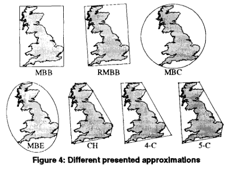

# Spatial data systems
Almost everything we do from our mobile devices rely on location data (Spatial data). Like:
* Uber
* Snapchat
* IoT sensors
* Location communication
* Satelite data (can be massive in scale)

## Spatial data primitives
**Point data**:
* 2D data (X,Y)
* 3D data (X,Y,Z)

**Region data**:
* Line
* Polygon

## Spatial queries
**Spatial range query**:
* Define a region (rectangle) we want to find all objects that intersect with our query region.
  * Can contain extended object and partial objects.

**Spatial join**:
* Retrieves a subset of objects that intersect.
* Example: two rivers (presented as lines), which cities do they intersect?

## Raster spatial data
* Vector data
  * Lines, points, and polygon
  * Geometry data
* Raster data
  * Pixel data, each pixel correspond to somthing (river, land, building, etc.)

We need different technique to work with these types of data.

## Traditional spatial query evaluation
1. Input data
2. **Filter** (Evaluation over geometric approximations) 
3. Candidate results
4. **Refine** (exact geometric tests)
5. Final result.

* The filter step is not expensive
* Refinement step is very expensive

**Motivation**:
* **Reduce the candidate results set** by using more precise approoximations from the filtering to minimize the size of the approximations set for the refinement step -> better performance.

## Spatial indexing and minimum bounding box

### R-tree basics
* Parent nodes contains pointers to their child nodes where the region of child nodes completely overlaps the regions of parent nodes.
* Goal: Find the index closest to our object.
* Property: we do not like overlap of child nodes. 
* Problem: a lot of empty space is enclosed inside a node

### Tighter structure (Convex Hull)
* Reduce the empty space that is enclosed inside a node.
* Problem: It is expensive to store (more complex geometry)

**Clip points**:
* Corners in the bounding box that is empty space that can be clipped away -> reduce empty space.
* How to do: consider the corner of your query rectangle, and a point inside that bounding box, check if that area that it cover is empty. 
  * Don't clip away points that cover an object. 
* Computing clip points:
  * For given corners ${R^b}$
    * Consider only points on the outer surface of the objects $o_i$
    * Consider only the closest corner of $o_i$
  * Also there exsist skylinebased clipped bounding box:
    * Get *skyline points* for each coner $R^b$
    * Chose up to k points.
    * Trade complexity for pruning power.
  * Stairline clip points
    * Retain the best value in each dimension
      * If point $p$ is best in x-dimesion, and point $q$ is best in the y-dimension. Then the point $r$ is the point of the corner we want to clip away.

## Spatial query evaluation on GPUs
Visual spatial data exploration. **Use GPU to draw polygons**.

* Analyse pollution level in a neighborhood
* Heatmaps or other visuallisations of spatial data.

