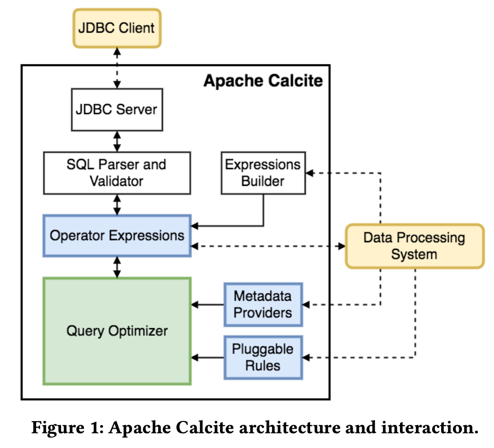
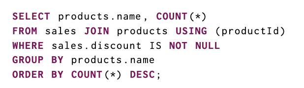
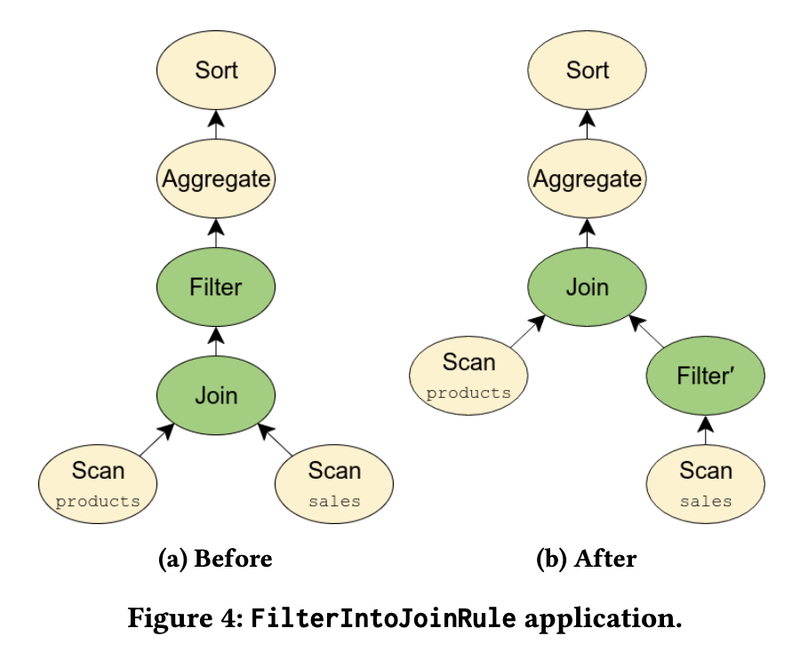
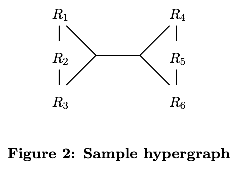

# Apache Calcite: A Foundational Framework for Optimized Query Processing Over Heterogeneous Data Sources” (SIGMOD 2018)

## Abstract
Presents Calcite as a foundational query framework *providing optimization, query processing, and SQL support for heterogeneous data sources*. Highlights its extensible optimizer, support for **multiple query languages**, **adapters for diverse data models**, and adoption in systems like Hive, Flink, and Druid.

> **Heterogeneous data** refers to a dataset composed of different data types, structures, formats or sources

## Strengths

* **Extensibility**: Modular design with pluggable rules, traits, metadata, planners.

* **Wide adoption**: Already embedded in major open-source frameworks.

* **Cross-system query optimization**: Supports federation across heterogeneous sources.

* **Support for diverse data models**: Relational, streaming, semi-structured, geospatial.

* **Proven reliability**: Open-source, widely tested, large community.

## Weaknesses

* **No native storage layer**: Must rely on external systems, limiting standalone use.

* **Performance evaluation gaps**: Hard to benchmark fairly against other optimizers.

* Geospatial support immature: Still under development.

* Learning curve: Complexity of optimizer internals and adapter design can hinder adoption.

* **Dependency on Java ecosystem**: Not as accessible for non-JVM systems.

## Relevance & Context

**Historical**: Fulfills Stonebraker & Çetintemel’s prediction (2005) that specialized engines would replace monolithic DBs.

**Industry impact**: Calcite underpins Hive, Flink, Druid, etc., making it crucial for modern big data systems.

**Academic value**: Provides a testbed for query optimization research and polystore exploration.

**Future importance**: As data grows more heterogeneous (IoT streams, JSON, geospatial), Calcite’s unified optimizer approach becomes increasingly critical.

## Introduction
**Sets context**: after System R, relational DBs dominated, but specialized systems (e.g., Spark, Flink, Elasticsearch) emerged.

Problems:
* Duplication of query optimization and SQL support across specialized systems.
* Need for cross-system optimized queries.

**Solution**: Calcite provides query parsing, optimization, and execution while leaving storage to specialized engines.

Emphasis on open-source friendliness, extensibility, support for multiple data models, and cross-system optimization.

## Related Work

Compares Calcite with:
* **Orca** (modular optimizer for Greenplum/HAWQ) – similar modularity but Calcite is broader.
* **Spark SQL** (Catalyst optimizer) – less sophisticated than Calcite’s dynamic programming approach.
* **Algebricks** – modular compiler backend, lacks Calcite’s cost-based optimization.
* **Garlic & FORWARD** – federated systems with different abstraction styles.
* **BigDAWG, Myria** – polystore and analytics engines with more limited optimization capabilities.

> **Calcite** is positioned as more extensible, general, and battle-tested than these.

## Architecture

> Calcite’s optimizer uses a tree of relational operators as its internal representation. 
> The optimization engine primarily consists of three components: 
> * rules, 
> * metadata providers, 
> * and planner engines
>
> **SQL Parser and validator**:
> Calcite contains a query parser and validator that can translate a SQL query to a tree of relational operators.
> As Calcite does not contain a storage layer, it provides a mechanism to define table schemas and views in external storage engines via *adapters* so it can be used on top of these engines.
>
> **Data processing systems**
> Calcite provides optimized SQL support to systems that need such database language support, it also provides *optimization support* to systems that already have their own language parsing and interpretation: 
> * Some systems support SQL queries, but without or with limited query optimization. 
> * For example, both Hive and Spark initially offered support for the SQL language, but they did not include an optimizer. For such cases, once the query has been optimized, **Calcite can translate the relational expression back to SQL.** 
> * This feature **allows Calcite to work as a stand-alone system on top of any data management system** with a SQL interface, but no optimizer.
> * The Calcite architecture is not only tailored towards op timizing SQL queries. It is common that data processing systems choose to use their own parser for their own query language. 
> * Calcite can help optimize these queries as well.

* Calcite is like a DBMS without storage or metadata repository.
* Components: parser/validator, relational algebra representation, adapters, optimizer (rules, metadata providers, planner engines).
* Can embed into SQL systems (e.g., Hive) or optimize queries from other query languages.
* Provides APIs for building relational expressions programmatically.

## Query Algebra
* Relational algebra is the core.
* Adds specialized operators (e.g., window operator for analytics).
* Uses traits to describe physical properties (ordering, partitioning, conventions).
* Allows transparent optimization across multiple backends (e.g., joining MySQL and Splunk data).

## Adapters
* Abstraction for integrating external data sources.
* Components: model, schema, schema factory.
* Provide operators like table scans, custom rules, and calling conventions.
* Enable pushing computations to backends when possible.
* Support federation by combining multiple backends.

## Query Processing and Optimization

> The query corresponds to the relational algebra expression presented in Figure 4a. 
> * **Filter before Join**: The `WHERE` clause only applies to the `sales` table, hence we can move the filter before the join.
> * **Result (Figure 4b)**: This optimization can significantly reduce query execution time since we do not need to perform the join for rows which do match the predicate. Hence the join operation becomes faster, due to a smaller dataset for sales.

> This optimization illustrates the flexibility of the Calcite approach
to optimization.

* Optimizer applies planner rules iteratively with cost-based search.

* Fully extensible (operators, rules, cost models, metadata).

* Provides hundreds of rules (e.g., pushing filters before joins).

* Metadata providers supply cost, row counts, etc.

* Two planner engines: cost-based (dynamic programming like Volcano) and exhaustive rule application.

* Supports materialized views via substitution and lattice-based rewriting.

## Extending Calcite
* **Semi-structured data**: ARRAY, MAP, MULTISET types, adapters for JSON-like stores (e.g., MongoDB).

* **Streaming**: SQL extensions (STREAM, windowing, tumbling/hopping windows).

* **Geospatial**: preliminary support (GEOMETRY type, OpenGIS compliance in progress).

* **Language-Integrated Query (LINQ4J)**: Java integration similar to Microsoft LINQ.

## Industry and Academia Adoption

* **Embedded Calcite**: used in Drill, Hive, Solr, Phoenix, Kylin, Flink, Storm, Apex, Samza, MapD, Qubole Quark, Lingual. Each uses different subsets of Calcite features.

* **Calcite Adapters**: available for Cassandra, Pig, Spark, Druid, Elasticsearch, MongoDB, Splunk, JDBC.

* **Research adoption**: polystore approaches (e.g., healthcare data integration).

## Future Work

* Enhance Calcite as standalone DBMS (DDL, indexes, constraints).

* More flexible planner designs.

* Parametric optimization approaches.

* Broader SQL compliance (OpenGIS, more functions).

* New adapters (e.g., scientific array databases).

* Better performance profiling.

* Performance benchmarking is difficult since Calcite is a framework, not a full system.

## Conclusion

Calcite bridges relational and heterogeneous data processing worlds. Its modular optimizer, adapters, and extensibility explain its wide adoption. The project is expected to expand in data model support, optimizations, and industry usage.

# Dynamic Programming Strikes Back” (SIGMOD 2008, Guido Moerkotte & Thomas Neumann)

## Abstract

The paper addresses limitations of existing join-ordering algorithms. Both **DPccp** (dynamic programming) and **Top-Down Partition Search** (memoization) handle only binary inner joins. Real queries involve **complex predicates** and **non-inner joins** (outer joins, antijoins, nestjoins).
The authors propose **DPhyp**, a new dynamic programming algorithm based on **hypergraphs** that efficiently handles complex predicates. They further extend the approach to support non-inner joins by reformulating them as hyperedges. Experimental results show that DPhyp outperforms prior methods.

## Strengths

**Innovation**: Extends dynamic programming to handle hypergraphs and non-inner joins.

**Efficiency**: Achieves orders-of-magnitude speedups in optimization time.

**Generality**: Supports widest class of joins (inner, outer, anti, semi, dependent).

**Solid theory & proofs**: Formalizes csg-cmp pairs, hypergraphs, and eligibility sets.

**Experimental rigor**: Clear benchmarking on synthetic but meaningful workloads (cycles, stars).

## Weaknesses

**Synthetic experiments only**: No benchmarks on real-world SQL queries or TPC workloads.

**Implementation assumptions**: Relies on idealized cost functions; integration into full optimizers is not shown.

**Complexity**: Algorithm is theoretically elegant but intricate to implement in practice.

Limited discussion of scalability beyond ~16 relations.

## Relevance & Context

**Historical**: Builds on Selinger’s System R optimizer and the DPccp breakthrough.

**Practical impact**: DPhyp’s ideas influenced later optimizers (including Apache Calcite, PostgreSQL research branches, and HyPer).

**Academic importance**: Demonstrates dynamic programming’s continued superiority over memoization for join ordering.

**Future significance**: With modern workloads involving complex predicates and non-inner joins (OLAP, data warehouses), this algorithm provides a foundation for real-world optimizers.

## Introduction

**Join ordering** is critical for query optimization.

Classic **DPsize** (Selinger et al.) explores bushy join trees but is inefficient. Authors introduced DPccp, which meets the lower bound in complexity.

**Top-Down Partition Search** restored memoization competitiveness.

However, neither DPccp nor Top-Down Partition Search handle:

* **Hypergraphs** (complex joins across >2 relations).

* **Non-inner joins** (outer joins, antijoins, etc.), which aren’t freely reorderable.

>This paper introduces **DPhyp**, tackling both issues efficiently.

## Hypergraphs

Formal definitions: 
* nodes = relations, 
* hyperedges = join predicates (possibly involving multiple relations).

Example: `R1.a + R2.b + R3.c = R4.d + R5.e + R6.f` → hyperedge ({R1,R2,R3}, {R4,R5,R6}).

Subgraphs, connectedness, and **csg-cmp** pairs (connected subgraph & connected complement) are defined.

Correct join enumeration requires considering all csg-cmp pairs.

## The Algorithm (DPhyp)

DPhyp generalizes DPccp to hypergraphs.

Core idea: recursively enumerate connected subgraphs and their complements to build plans.

Key routines:

* **Solve**: initializes table, kicks off enumeration.

* **EnumerateCsgRec**: expands connected subgraphs.

* **EmitCsg**: generates candidate complements.

* **EnumerateCmpRec**: grows complements recursively.

* **EmitCsgCmp**: combines two plans and stores best cost.

Avoids duplicate enumerations and handles commutativity.

Memory usage comparable to earlier DP algorithms.

## Evaluation (Hypergraphs & Graphs)

Benchmarked against **DPsize** and **DPsub**.

![![alt text]](images/cycle-star-based-hypergraphs.png)

Used **cycle-based** and **star-based** hypergraphs with varying numbers of relations.

Results:

* For small queries, differences negligible.

* For larger queries (8–16 relations), **DPhyp is consistently superior**.

* DPsub worse than DPsize; both much slower than DPhyp.

* On regular graphs, DPhyp = DPccp (optimal baseline).

## Non-Reorderable Operators

Extends algorithm to handle **outer joins, antijoins, semijoins, nestjoins, and dependent joins**.

Introduces **syntactic eligibility sets (SES)** and **total eligibility sets (TES)** to capture operator constraints.

Reformulates reorderability issues into **hypergraph edges**, reducing invalid plan generation.

Demonstrated that handling outer joins via hypergraphs drastically improves runtime compared to generate-and-test methods.

Experiments show DPhyp remains faster than DPsize, even with non-inner joins.

## Translation of Join Predicates

Some complex predicates can be rewritten into multiple hyperedges.

Generalizes hypergraphs to **triples (u, v, w)** to allow relations that can appear on either side of a join.

Preserves expressiveness while maintaining efficient search space exploration.

## Related Work

DPccp and Top-Down Partition Search: only inner joins.

Galindo-Legaria & Rosenthal: outer joins in DPsize.

Bhargava et al. and Rao et al.: extended handling for hyperedges/antijoins, but inefficient due to DPsize basis.

DPhyp unifies and outperforms these approaches.

## Conclusion

* DPhyp efficiently handles hypergraphs and non-inner joins.

* By encoding non-reorderable operators as hyperedges, it avoids complexity blowup.

* Outperforms DPsize, DPsub, and other competitors.

* Reinforces the dominance of **dynamic programming** over memoization in query optimization.
