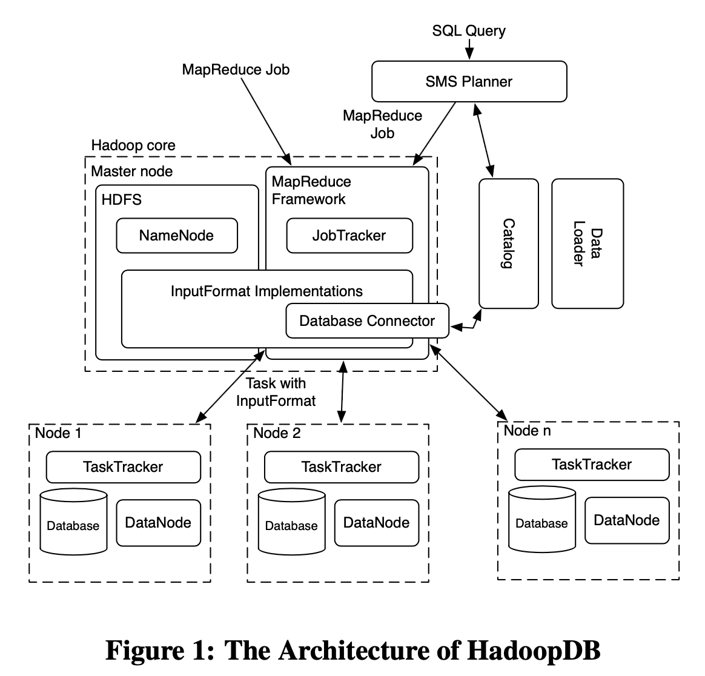

# HadoopDB

Why use a hybrid, when benchmarks shows that HadoopDB is slower?

They only test on 100 nodes, but they say that Paralllel DBs are slow on the 1000 nodes.
* Why not test on 1000 nodes? To show if HadoopDB is faster.

They use the architecture of hadoop.
* JobTracker + NameNode
* TaskTracker + DataNode.

Whats new?
* SQL to MapReduce to SQL (SMS) Planer -- Optimizaiton
* Dataloader
* Catalog
  * Includes connection parameters such as database location, driver class and credentials
  * And includes metadata such as data sets contained in the cluster, replica locations, and data partitioning properties.
* Database connecter + Database.
  * The Connector connects to the database, executes the SQL query and returns results as key-value pairs.
  * Cons: Different databases require different read query optimizations. Hence the need too implement more connectors instead of only MySQL nad PostgreSQL.

# New Query Optimization Techniques in the Spark Engine of Azure Synapse

Figure 3:
* To subtrees of a bigger tree
* The left subtree do the same join as the subtree to the right with T1 and T2.
* Figure 4 shows this overlap. Where it can reuse this overlap in (b).