# Motivation

Duo to the "*one-size-does-not-fit-all*" dictum.
A rise of specialized platforms like 
* DBMS, NoSQL and MapReduce-like platforms
* Reportedly over 200 different platforms under the umbrella of NoSQL.
* Currently in 2025: 490 DBMS  https://db-engines.com/en/systems
* Many more systems now than we had back in the days.

All these platforms are build for different aspects to achieve high performance and scalability.

## Big data landscape
https://www.pracdata.io/p/open-source-data-engineering-landscape-2025 

Why use different tools?
Data analytics today
* Machine learning
* Relational 
* Graph
* Streaming (iot)
* Deep learning

One cannot fit all

Todays data analytics is beyound the limits of a single platform.
Examples:
* IBM reported that North York hospital needs to process 50 diverse datasets, which run on a dozen different platforms
* Airlines need to analyze large datasets, which are produced by different departments, are of different data formats to produce global reports ofr decision makers.
* Oil & Gas companies need to process large amounts of diverse data spanning various platforms.
* Several data warehouse applications require data to be moved from a MapReduce-like system into a DBMS for further analysis
* Business intelligence typically requires an analytic pipeline composed of different platforms
* Using multiple platforms for machine learning improves performance significantly

How do we cope with these new requirements as developers?
* We have to write ad-hoc programs and scripts to integrate different platforms.
  * This is tedious, time-consuming, and costly task.
  * Requires knowledge of the different platforms to achive high performance and scalability.
  * Hence we need to decide which processing platforms to use

## Cross paltform data processing
A need for a systematic approach to enable efficient cross platform data processing.

Platform independence from applicaitions. 
* Users simply send their tasks (or queries) expressing the logic of their applications, and the cross-platform system decides on which platform(s) to execute each task with the goal of minimizing its cost (e.g., runtime or monetary cost).

## Challenges oof building a cross platform system
1. It has to find the suitable platforms for a given task + choose the most effcient one.
2. There is a high uncertainty since different platforms are autonomous and one has little control over them.
3. Performance gains of using multiple platforms must compensate the added cost of moving data across platforms.
4. Inter platform parallelism to prevent slow platforms from dominating execution time
5. Design a system to be extensible to new platforms and applications
6. Easy to use.

## Goal of Apache Wayang
Enable applications and users to run data analytic tasks efficiently on one or more data processing platforms.

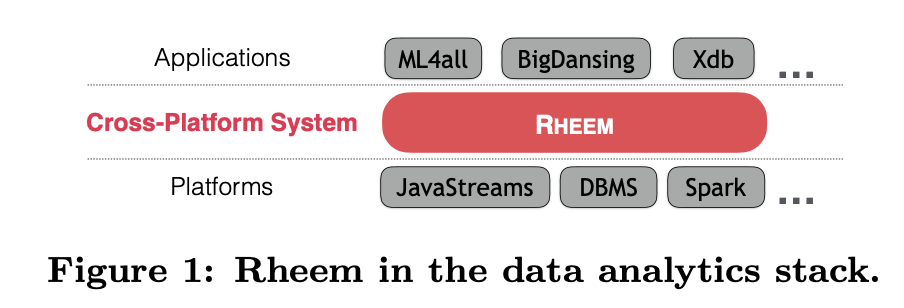
Applications send tasks to Rheem, which in turn decides where to execute them.

Platsforms supported:
* Spark, Flink, JavaStreams, Postgres, GraphX, GraphChi, and Giraph.

Currently being tested on a airline company and biomedical resarch institute. 

# CROSS-PLATFORM PROCESSING

Four situations in which an application requires support for cross-platform data processing:
* Platform-independence
* Opportunistic cross-platform
* Mandatory cross-platform
* Polystore

## Platform-independence
> Applications run an entire task on **a single platform** but may require switching platforms for different input datasets or tasks usually with the goal of achieving better performance.

Applications are usually tied to a specific platform. This may not constitute the ideal case for two reasons.
1. Migrating an application from one platform to another is a time-consuming and costly task. (Hence not the best choice)
2. For different inputs of a specific task, a different platform may be the most efficient one, so the best platform cannot be determined statically.
   1. Example, running a task on a big data platform for very large datasets is often a good choice, while single node pllatforms with little overhead cost are better for smaller dattasets.

### Experiment
Here the experiment was running an error detection task on a widely used Tax dataset. To check the salaries and taxes, to find inconsistencies between two different persons if one earns a higher salary but pays a lower tax.
Run this task. 
> ∀t1,t2,¬(t1.Salary > t2.Salary ∧t1.Tax < t2.Tax)

Here they compare 
* NADEEF (data cleaning tool)
* SparkSQL (general-purpose framework)
* Rheem (Use either Spark or JavaStreams per run)
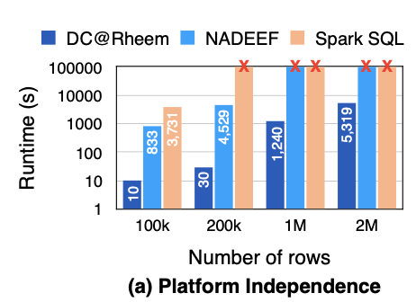
> Notice logarithmic scale

Results:
* Rheem outperform both baselines.
* The gain comes from Rheem being able to switch between platforms.
  * Using JavaStreams for small datasets speeding up the data cleaning task by avoiding Spark’s overhead, while it used Spark for the largest datasets.
* Contrast to SparkSQL cannot process inequality joins (greater than, less than) efficiently, Rheem’s extensibility allowed us to plug in a more efficient inequality-join.
* Forgot to tell why NADEEF is slower.

## Opportunistic cross-platform
> Applications might also benefit performance-wise from **using multiple platforms** to run one single task.

Example:
* Run a gradient descent algorithm like SGD on top of Spark. But also mixing it with JavaStreams improves performance.

Problem:
* Developing such cross-platform applications is difficult: developers must know all the cases where it is beneficial to use multiple platforms and how exactly to use them.
* These opportunities are often very hard (if not impossible) to spot.
* Even worse, like in the platform independence case, they usually cannot be determined a priori.

What Rheem does:
* Rheem finds and exploits opportunities of using multiple processing platforms

### Experiment
Machine learning example with ML4all, where we show the benefit of using multiple platforms to perform **one single task**.

3 fundamental phases:
* Preparation
* Processing
* Convergence

7 loogical ooperators are **mapped** to Rheem operators:
* Preparation phase - initialization of the algorithm
  * **Transform** operator
  * **Stage** operator
* Processing phase - computes the gradient and updates the current estimate of the solution.
  * **Sample** operator
  * **Compute** operator
  * **Update** operator
* Convergence phase - repeats the processing phase based on the number of iterations
  * **Loop** operator
  * **Converge** operator

We demonstrate the benefits of using Rheem with a classification task over three benchmark datasets, using Stochastic Gradient Descent (SGD).
> Notice they all use the same SGD algorithm.

Why Rheem is faster? Two main reasons:
1. Opportunistically running the Compute, Update, Converge, and Loop operators **on JavaStreams**. Thereby *avoiding* some of the Spark’s overhead. Rheem runs the rest of the operators on Spark.
   *  MLlib and SystemML do not avoid such overhead by purely using Spark for the entire algorithm.
2. ML4all leverages Rheem’s extensibility to plug an efficient sampling operator, resulting in significant speedups.

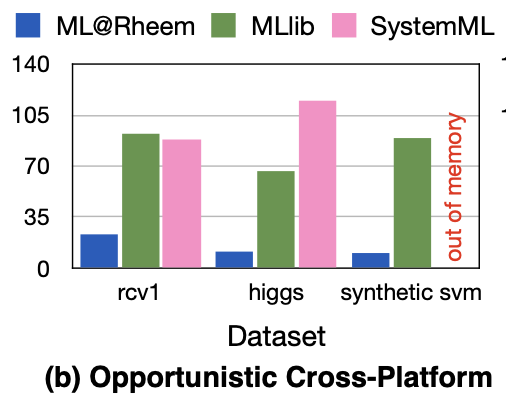
> Notice linear y-axis.

## Mandatory cross-platform
> Applications may require multiple platforms because the platform where the input data resides, e.g., PostgreSQL, cannot perform the incoming task, e.g., a machine learning task. Thus, **data should be moved from the platform it resides to another platform**.

* There are cases where an application needs to go beyond the functionalities offered by the platform on which the data is stored.
* Move the projected data from one platform to another platform. Simply because the other platform cannot do it (hence the meaning of mandatory). 

What Rheem does:
* Rheem not only selects the right platforms for each task but also moves the data if necessary at execution time.

### Experiment
Using xDB, a system on top of Rheem with database functionalities. 
* It provides a declarative language to compose data analytic tasks, while its optimizer produces a plan to be executed in Rheem.

They run a pagerank on the intersection of two datasets, and show the benefit of Rheem.
* Doing this is hard to express in SQL, and inefficent to run on a DBMS. 
* Hence: What Rheem does is moving the input datasets from PostGres to Spark.

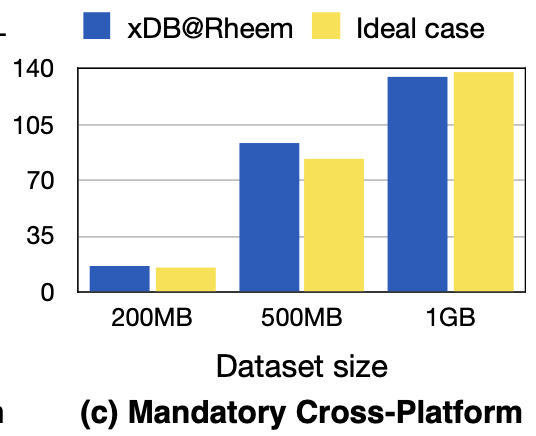

The baseline considers the ideal case, where **the data is on HDFS** and Rheem simply uses either JavaStreams or Spark to run the tasks.

Results:
* Rheem allows xDB (xDB@Rheem) to achieve similar performance with the ideal case in all the situations, while **fully automating** the process.
> Notice that Rheem also needs to move data out of Postgres to perform the tasks.

## Polystore
> Applications may require multiple platforms because the input data is stored on multiple data stores.

* Data is collected in different formats and on heterogeneous storage platforms (data lakes).

Problem for Developers:
* users perform not only tedious, time-intensive, and costly data migration, but also complex integration tasks for analyzing the data.

What Rheem does:
* Rheem shields the users from all these tedious tasks and allows them to instead focus on the logic of their applications.

### Experiment
Example with the Data Civilizer system. It is a big data management system for data discovery, extraction, and cleaning from data lakes in large enterprises.

Data Civilizer uses Rheem to perform complex tasks over information that spans multiple data storages.
* Measure the efficiency of Rheem for these polystore tasks with TPC-H query.

The experiment assumes 3 platfomrs:
* The data is stored in HDFS (LINEITEM and ORDERS)
* Postgres (CUSTOMER, REGION, and SUPPLIER)
* A local file system (NATION)

This task performs join, groupby, and orderby operations across three different platforms.

The common practice (baselines):
* Move the data into the database to enact the queries inside the database
* Move the data entirely to HDFS and use Spark.

Fair comparison
* Set the “parallel query” and “effective IO concurrency” parameters of Postgres to 4.

Result: Rheem (DataCiv@Rheem)
* Is significantly faster (up to 5×) than the current practice.
* Loading data into Postgres is already approximately 3×slower than it takes Rheem to complete the entire task.
* Scale factor 100
  * The pure execution time in Postgres for scale factor 100 amounts to 1,541 sec compared to 1,608 sec for Rheem, which exploits Spark for data parallelism.
* Rheem has negligible overhead over the case where the developer writes ad-hoc scripts to move the data to HDFS for running the task on Spark.
* Scale factor 1
  * Rheem is twice faster than Spark for scale factor 1 because it moves less data from Postgres to Spark.

> The scale factor is the amount of different datasets from TPC-H. 
> **Missing to say what scale factor is**.

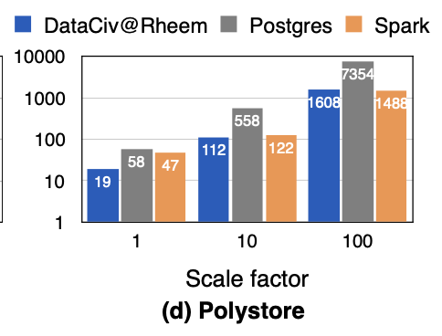
> Notice logaritmic scale.

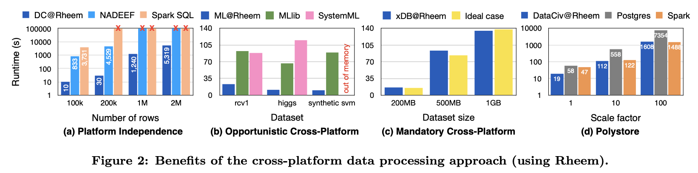

# Rheem Model
Rheem is not yet another data processing platforms.
It is designed to work between applications and platforms
* Help choose the righ platform(s) for a given task.
* users avoids to understand the details of the underlying platforms

## Data quanta
> Data quanta: the smallest processing units from the input datasets.

A data quantum can express a large spectrum of data formats, such as database tuples, edges in a graph, or the full content of a document.

Allows Rheem to work in a highly parallel fashion, if necessary, to achieve better scalability and performance.

## Rheem Plan
> Rheem Plan: a directed data flow graph whose vertices are Rheem operators and whose edges represent data flows among the operators.

Rheem operator
* Map or Reduce operator, UDF, ...

Rheem plan must have:
* At least one source operator i.e. an operator producing input data quant.
* One sink operator per branch i.e., an operator retrieving or storing the result.

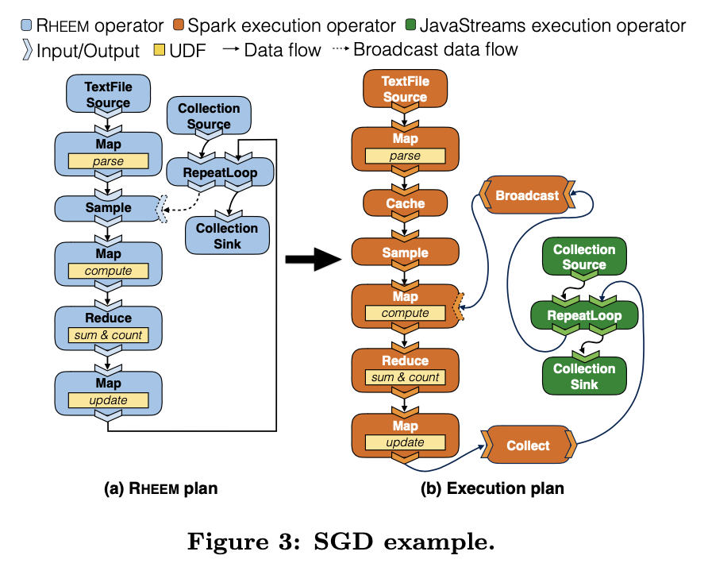

Figure 3(a) shows a Rheem plan for the stochastic gradient descent algorithm (SGD).
* Notice we have two source operators and one sink operator
> Broadcast is data movement

## Execution plan
Given a Rheem plan as input, Rheem uses a cost-based optimization approach to produce an execution plan by selecting one or more platforms to efficiently execute the input plan.

The cost can be:
* any user-specified cost, e.g., runtime or monetary cost.

The resulting execution pllan is also a data flow graph
* where the vertices are **now execution operators**.

Execution operator:
* implements one or more Rheem operators with platform-specific code
* Additionally, users can attach a UDF to each execution operator in order to specify its cost.
  * Rheem learns such costs from execution logs using machine learning.

Figure 3(b) shows the SGD execution plan produced by Rheem when Spark and JavaStreams are the only available platforms.

## Operator mappings
> To produce an execution plan, Rheem relies on flexible m-to-n mappings to **map Rheem operators to execution operators**.

Supporting  m-to-n mappings is particularly useful:
* Allows mapping subplans of Rheem operators -> subplans of execution ooperatos. (d) from Figure 4.
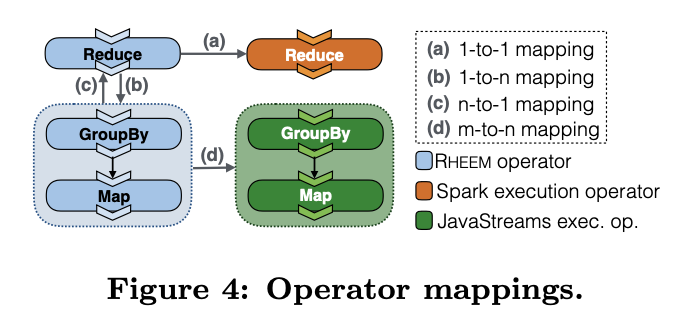

* (a) 1-1 mapping
  * directly maps to the Reduce Spark execution.
  * does not have a direct mapping to a JavaStreams execution operator
* (b) 1-n mappings
  * From reduce we can go to many subplans
* (c) n-1 mappings
  * From many subplans maps to one reduce
* (d) n-m mappings
  * From subplan to subplan

## Data movement
> Data movement: Data flows among operators via communication channels (or simply channels).

A channel can be any internal data structure within a data processing platform
* RDD for Spark
* Collection for JavaStreams
* or simply a file.

In the case of two execution operators of different platforms connected within a plan, it is necessary to convert the output channel of one to the input channel of the other (e.g., from RDD to Collection).

Example Figure 3 (b):
* Rheem can convert a Spark RDD channel to a JavaStreams Collection channel using the SparkCollect operator.

## Extensibility
Users can add new Rheem and execution operators by merely extending or implementing few abstract classes/interfaces. 

Rheem provides template classes to facilitate the development for different operator types.

Users also add operator mappings by simply implementing an interface and
specifying a graph pattern that matches the Rheem operator.

In short:
* Users can add new Rheem and execiton operators.
* Rheem provides template for this
* Users can also add operator mappings.

Result:
* User can add new platforms to Rheem.
  * By its execution operators and their mappings and
  * The communication channels that are specific to the new platform with at least one conversion operator from the new channel to an existing one and vice versa.

# Rheem’s ecosystem and architecture
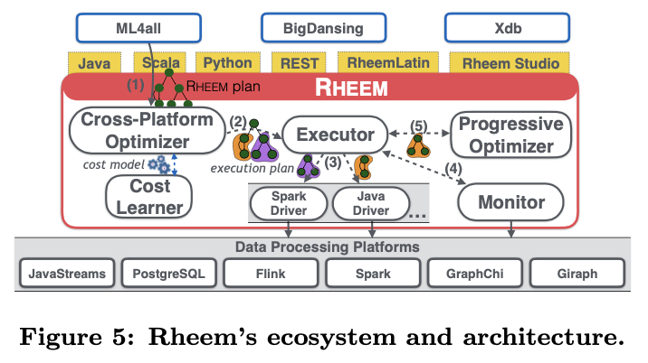
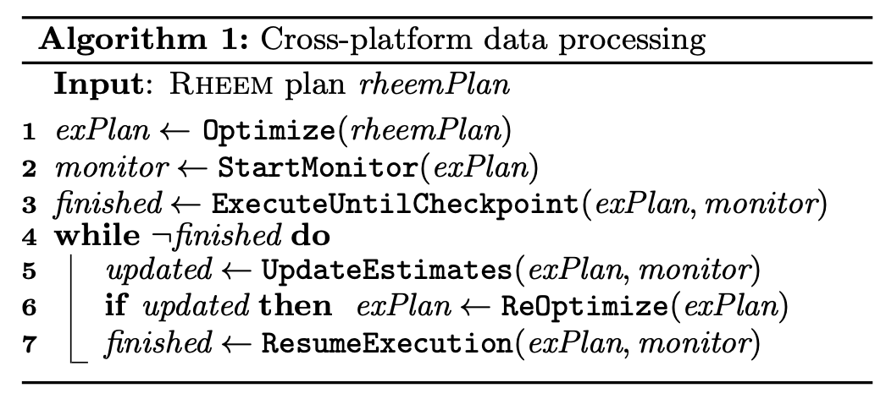

3 Main applications are built on top of the Rheems architecture.

Step 1:
* Users provide a **Rheem plan** to the system (Step (1) in Figure 5), using Java, Scala, Python, REST, RheemLatin, or Rheem Studio API (yellow boxes in Figure 5)
Step 2:
* The **cross-platform optimizer** compiles the Rheem plan into an execution plan
* And specifies the processing platforms to use
Step 3:
* The **executor** schedules the resulting execution plan on the selected platforms.
Step 4:
* The **monitor** collects statistics and checks the health of the execution
* Collects execution logs.
Step 5:
* The **progressive optimizer** re-optimizes the plan if the cardinality estimates turn out to be inaccurate.

The **cost learner** helps users in building the cost model offline.

## The cross pllatform optimizer
It is responsible for selecting the most efficient platform for executing each single operator in a Rheem plan.

It does **not** perform any logical or physical optimization
* Such as operator reordering or choosing operator implementation.

This takes place at the application or platform level.

They use a cost-based approach:
They split a given Rheem plan into subplans and determine the best platform for each subplan so that the total plan cost is minimized.

The optimization has four main phases
* Plan inflation
* Cost estimates annotation
* Data movement planning
* Plan enumeration

> Why not use rule based optimization?
> Using optimization based on its processing patterns is neither practical nor effective.
> 1. By setting rules, one may make only very **simplistic decisions** based on the different cardinality and complexity of each operator.
> 2. The cost of a task on any given platform depends on many input parameters, which hampers a rule-based optimizer’s effectiveness as it **oversimplifies** the problem.
> 3. Third, as new platforms and applications emerge, **maintaining** a rule-based optimizer becomes **cumbersome** as **the number of rules grows rapidly**

### Plan inflation
It inflates each Rheem operator of the input plan by applying a set of operator mappings.

These mappings determine how each of the platform-agnostic Rheem operators can be implemented on various platforms with execution operators.

Example:
The gray box in Figure 6 shows the inflated Reduce operator from the SGD plan of Figure 3(a) after applying the mappings of Figure 4.
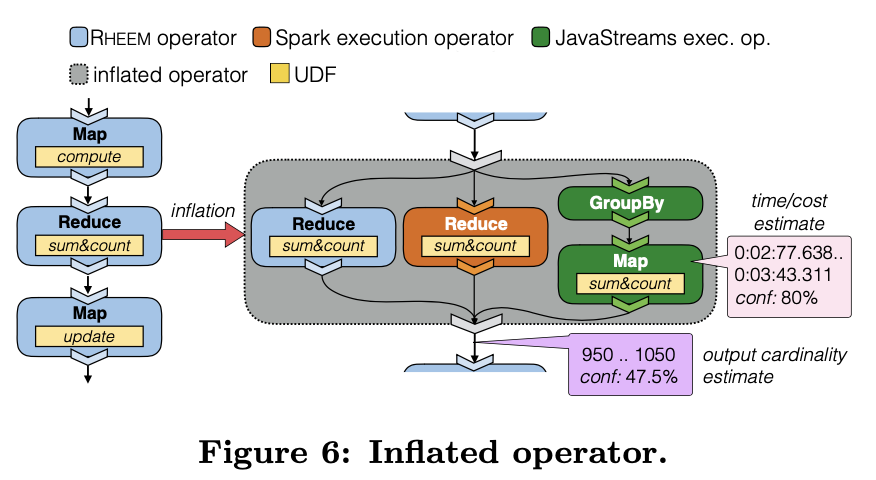.

Pro: 
* This approach allows the optimizer to later enumerate all possible execution plans without depending on the order in which the mappings are applied

In-short:
* Inlated operator shows all possible execution operators for a Rheem operator. 
* Helps **find** possible exectution operators for a Rheem operator.

### Cardinality and Cost Estimates.
Next, the optimizer needs to annotate the inflated plan with the cost of each execution operator.

**Time/cost estimate**
* Pink box in Figure 6
Rheem uses a modular and fully UDF-based cost model and represents cost estimates as intervals with a confidence value (see pink box in Figure 6).

Advantagee of interval-based estimates allows it to perform on-the-fly re-optimization.

The cost depends on
* Resource usage (CPU, memry, disk, and network)
* The unit costs of each resurce (CPU cycle costs)
* Hardware charateristics (\#Nodes and \#CPU Cores)
These are encoded in a configuration file for each platform.

**Cardinality estimate**
* Purple box in Figure 6.
Given that the output cardinality of one operator is equal to the input cardinality of its subsequent operators, Rheem uses the following approach for estimating the output cardinality of each operator.
1. It computes the output cardinalities of the source operators via sampling.
2. It then traverses the inflated plan in a **bottom-up fashion** to estimate the output cardinality of all subsequent operators in the inflated plan.

In short:
* What is the estimated cost of each plan.

### Data movement planning
Given an inflated plan with its estimates. Now the optimizer need to estimate how to best move data among execution operators of different platforms and what the cost of such data movement is.

Why its important to consider data movement at optimzation time:
1. The cost can be very high
2. The cost must be minimized to be able to scale to several platforms
3. It typically involves operations that go beyond a simple byte copy (caching, data transformations, 1-to-n communication, among others).

After the best data movement strategy is found, its cost is attached to the inflated plan.

In short:
* **How to move** data among the execution ooperators.
* **What is the cost** of this movement?

### Plan enumeration
At last, the optimizer determines the optimal way of executing an input Rheem plan based on the cost estimates of its inflated plan.

Find the best execution plan.

Challenge:
* Exponential size of the search space
* A plan with $n$ operators, each having $k$ execution operators, leads to $k^n$ possible plans.

Example of this:
* PageRank plan which consists of n = 27 Rheem operators, each with k = 5 (execution operators). Hence $5^{27}$
* This yields $7.45 ×10^{18}$ possible execution plans.

How to not enumerate all subplans?
* Use pruning.

## Executor
The executor receives an execution plan from the optimizer to run it on the selected data processing platforms.
* (Lines 3 and 7 in Algorithm 1)

The executor follows wellknown approaches to parallelize a task over multiple compute nodes.

It divides an execution plan into stages.
A **stage** is a subplan where: 
1. All its execution operators are from the same platform
2. At the end of its execution, the platforms need to give back the execution control to the executor
3. Its terminal operators materialize their output data quanta in a data structure, instead of being pipelined into the next operator.

### Example
In our SGD example of Figure 3(b), the executor divides the execution plan into six stages as illustrated in Figure 7.
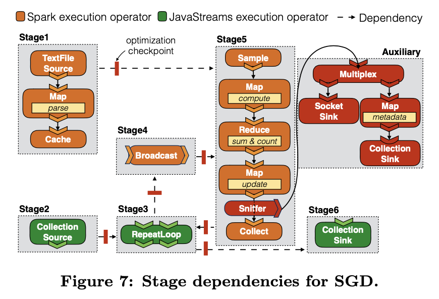

It dispatches the stages to the relevant platform drivers, which in turn submit the stages as a job to the underlying platforms. 

Stage1 and Stage2:
* Are dispatched first in parallel and any other stage is dispatched once its input dependencies are satisfied.

The red boxes:
* As data exploration is a key piece in the field of data science, the executor optionally allows applications to run in an **exploratory mode** where they can pause and resume the execution of a task at any point.
* This is done by injecting sniffers into execution plans and attaching auxiliary execution plans.

## Monitor
Helps with transparenccy in a setting where there is a high uncertainty with the cross platform optimizer. (Line 2 in Algorithm 1).
* The semantics of UDFs and data distributions are usually unknown because of the little control over the underlying platforms.
* This uncertainty can cause poor cardinality and cost estimates and hence can negatively impact the effective- ness of the optimizer.

The monitor collects light-weight execution statistics for the given plan, such as **data cardinalities** and **operator execution times**.
* Its also aware about lazy executions.

What the monitor is used for:
* Rheem uses these statistics to improve its cost model and re-optimize ongoing execution plans in case of poor cardinality estimates.
* Checking the health of the execution.
  * If it finds a large mismatch between the real output cardinalities and the estimated ones, it pauses the execution plan and sends it to the progressive optimizer.

## Progressive opimizer
To mitigate the effects of bad cardinality estimates, Rheem employs a progressive query optimization approach.

Two main challenges:
1. We have only **limited control** over the underlying platforms, which makes plan instrumentation and halting executions difficult.
2. Re-optimizing an ongoing execution plan must efficiently consider the results already produced.

How to tackle these challenges:
* By using **optimization checkpoints**. 

An **optimization checkpoint** tells the executor to pause the plan execution in order to consider a re-optimization of the plan beyond the checkpoint.
* Example Stage1 in figure 7.

Where to put thoptimization checkpoints? Whereever
1. cardinality estimates are uncertain (having a wide interval or low confidence)
2. The data is at rest (e.g., a Java collection or a file). The cache operator.

The latter gets the actual cardinalities observed so far by the monitor and re-computes all cardi- nalities from the current optimization checkpoint. (Line 5 in Algorithm 1).

The line of code:
* In case of a mismatch, it re-optimizes the remainder of the plan (from the current optimization check- point) using the new cardinalities (Line 6).
* It then gives the new execution plan to the executor, which resumes the ex- ecution from the current optimization checkpoint (Line 7).

Rheem can switch between execution and progressive optimization any number of times at a negligible cost.

## Cost Model Learner
The cost learner is responsible for training and refining RHEEM’s cost model, which the optimizer uses to pick the cheapest execution plan.

### Learning the Cost Model

**Cost model structure**:
Each execution operator has a parametric cost function
Defined as $r^m_o$
o: Execution operator
m: Resource usage (CPU, memory, disk, or network)

Example: 
The cost function to estimate the CPU cycles required by the JavaFilter operator is:
$r^{CPU}_{Javafilter} := c_{in} \times (\alpha + \beta) + \delta$

>Parameters aplha, beta, delta

$c_in$: denote input cardinality
Aplha: denote the CPU cyces for each input 
Beta: UDF
Delta: some fixed overhead (start-up, scheduling)

The total cost estimate for operator o is defined as:
$f_o = t^{CPU}_{o}+t^{mem}_{o}+t^{disk}_{o}+t^{net}_{o}$

To learn the parameters of each resource such as the α,β,δ is not trivial.

* To learn these parameters Rheem use execution logs to learn these parameters in an offline fashion.
* It then *model* the cost of individual execution operators as
a *regression problem*.

> Note that the execution logs contain the runtimes of execution **stages**, and not of individual operators.

**Data collection**:
As queries run, the *monitor* (RHEEM component) collects execution statistics (real runtimes, I/O, cardinalities, platform metrics).

**Learning Step**:
* It uses these execution logs to fit the parameters of the cost functions.

We have an execution stage:
$({(o_1,C_1),(o_2,C_2),...(o_n,C_n)},t)$

* $o_i$: are execution operators, 
* $C_i$ are input and output true cardinalities, and
* $t$ is the measured execution time for the entire stage

Total cost function:
Let $f_i(x,C_i)$ be the total cost function for execution operator $o_i$ with $x$ being a vector with the parameters of all resource usage functions (e.g., CPU cycles, disk I/O per data quantum).

We want to find the vector: 
$x_{min} = arg\space min_x \space \space loss(t, \sum_{i=1}^{n}f_i(x,C_i))$ 

This loss function is a relative loss function. 
In combination with the loss function, they also apply a **genetic algorithm** to find $x{min}$

* It uses this combination to minimize error between predicted and observed costs.

> In short: **genetic algorithm** is a computer program inspired by natural selection that is used to generate optimal (the best) solutions to a problem

### Log generation
The more execution logs are available, the better Rheem can tune the cost model.
Hence Rheem comes with a log generator.
This way Rheem can automatically train the cost model.

# Building a Rheem application
Rheem provides a set of native APIs for developers to build their applications.
* Java, Scala, Python, and REST

The code developers have to write is fully agnostic of the underlying platforms.

In case the user wants to force Rheem to execute a given operator on a specific platform, they can invoke the `withTargetPlatform`  method.
Also they can force the system to use specific execution operators va the `customOperator` method.
* This enables users to employ custom operators without having to extend the API.

Rheem also provides two APIs that target non-expert users:
* RheemLatin
  * a data-flow language
* Rheem Studio
  * a visual IDE

## RheemLatin
A data-flow language for users to specify their tasks.

Goal is to provide ease-of-use to users without compromising expressiveness.

Example, users can specify the platform for any part of their queries.

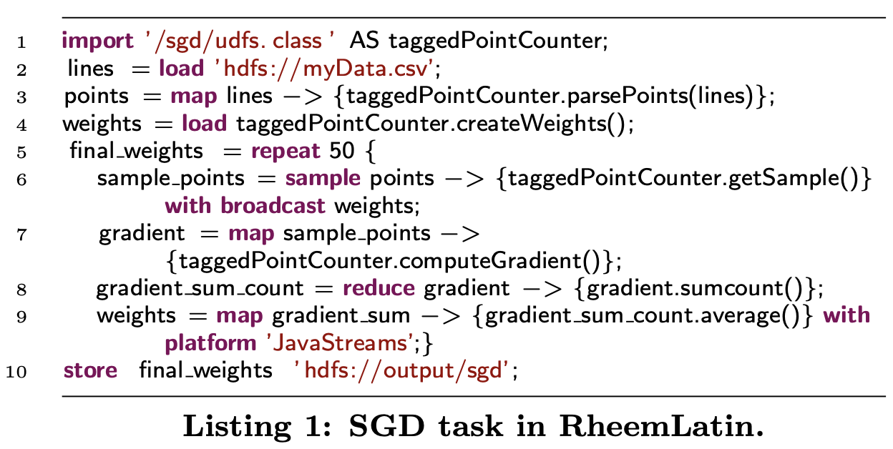

## Rheem Studio
Some users might still be unfamiliar with programming and data-flow languages.
Therefore Rheem provides a visual IDE where users can compose their data analytic tasks in a drag and drop fashion.

Figure 8 shows the Rheem Studio’s GUI.

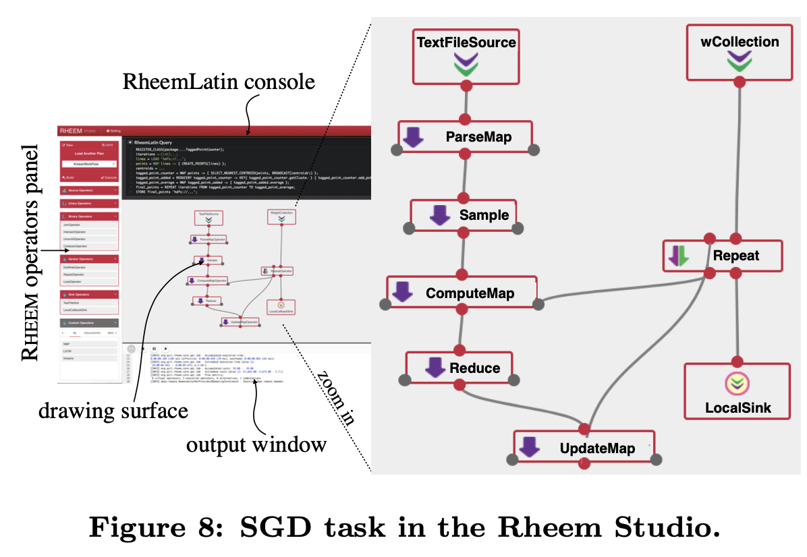

# Experiment
Goal is to further show the benefits of the cross-platform data processing approach over the single-platform data processing approach.

They focused on the two cases
* Platform-independence case
* Opportunistic cross-platform case

They evaluate the two techniques:
* Progressive optimization
* Data exploration  

Lastly they compare Rheem with Musketeer

## Setup
* They ran the experiment on a cluster of 10 machines.

Specs:
* Each node has one 2 GHz Quad Core Xeon processor, 
* 32 GB main memory, 
* 500 GB SATA hard disks, 
* a 1 Gigabit network card 
* and runs 64-bit platform Linux Ubuntu 14.04.05.

They used Rheem for the cross platform data processing.
Platforms used for single platform data processing:
* JavaStreams
* PostGres
* Spark
* Flink
* GraphX
* Giraph
* JGraph
* HDFS to store files.

> They disabled the Rheem stage parallelization feature to have only one single platform running at any time.

Data analytic tasks used:
* Text mining
* Machine learning
* Graph mining. 

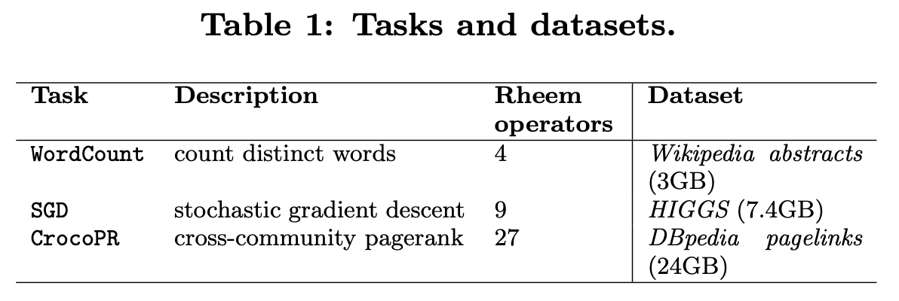

## Experiment Results
### Platform independence
Remember in this case: Rheem use a single platform when executing a task and checked if it chooses the one with the best runtime.
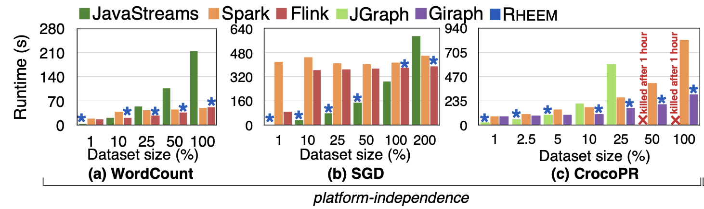
> Blue star indicate the platform choosed by Rheem.

Observation:
* There is no single platform that outperforms all other platforms for all cases.
  *  The differences in the runtime values are significant
  *  Example: Flink can be more than 4×faster than Spark and Spark can be twice faster than Flink for the different tasks we considered in our evaluation.

**WordCount**: 
Comparing JavaStreams, Spark, and Flink

* Dataset size 1: 
  * JavaStream is fastest
* Dataset size 10, 25, 50:
  * Flink is fastest 
  * JavaStream cannot follow with increased dataset sizes.
    * Duo to single threaded data access.
* Dataset size 100: 
  * Spark is fastet
  * Flink is very close.
  * Rheem chooses flink

> In majority of the cases Rheem chooses the optimal platform for platform independence.

**SGD**: 
Comparing JavaStreams, Spark, and Flink

* Dataset size 1, 10, 25, 50: 
  * JavaStream is fastets
  * Spark and Flink are very bad!
* Dataset size 100:
  * JavaStream is fastest
  * Rheem uses Flink.
* Dataset size 200:
  * Flink is fastest
  * JavaStream is very bad!

**CrocoPR**
Comparing JGraph, Spark, and Giraph
* Dataset size 1, 2.5:
  * JGraph is fastest
* Dataset size 5:
  * Giraph is slightly faster
  * Rheem chooses JGraph
* Dataset size 10, 25:
  * Giraph is fastest
  * JGraph starts to be slower, it cannot efficiently process large datasets.
* Dataset size 50
  * Giraph is fastest
  * JGraph is killed after 1 hour.

> Spark is not good.

**Rheem selects the most efficient platform for all tasks we considered.**

### Opportunistic Cross-Platform 
Here what is evaluated is Rheem is able to
1. Use multiple platforms to reduce execution times
2. Spot "hidden" opportunities for the use of multiple platforms.
> Rheem can use any platform combination for performing one single task.

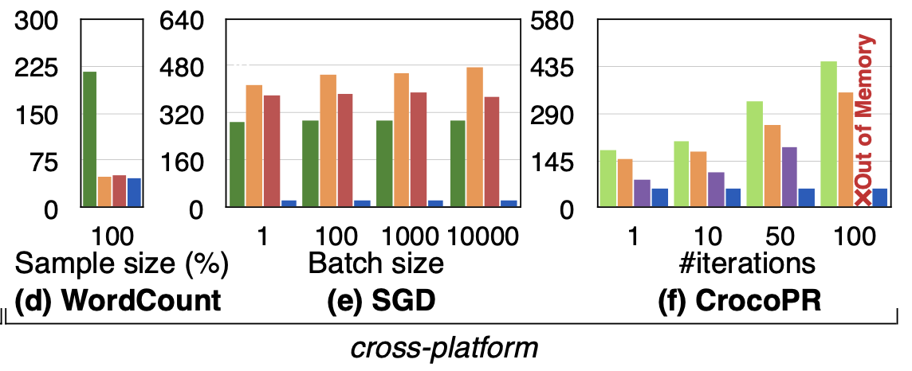

> Rheem is superior. 

Rheem is:
* up to 20×faster than Spark
* up to 17×faster than Flink
* up to 12×faster than JavaStreams
* up to 8×faster than JGraph
* up to 6×faster than Giraph
* and more than 3×faster than Postgres.

Reason:
* **SGD**
  * Rheem mixes Spark with JavaStreams.
  * It uses **Spark** execution operators when dealing with a large number of data points, i.e., for the *Sample* operator and all operators *outside* the loop. 
  * In contrast, it uses **Java** execution operators for *computing* and *updating* the gradient of *a single data point*, which is done inside the loop.
* **CrocoPR**
  * Rheem uses a combination of Flink and JGraph, even though Giraph is the fastest baseline platform.
  * The reason is that after the preparation phase on Flink, the input dataset for the PageRank operation on JGraph is a couple of megabytes only.
* **WordCount**
  * System slightly outperforms Spark and Flink by bringing the results to the driver application via JavaStreams rather than directly from Spark, which is the fastest baseline platform for this task.

### Evaluation of Join, progressive optimizer and Data exploration
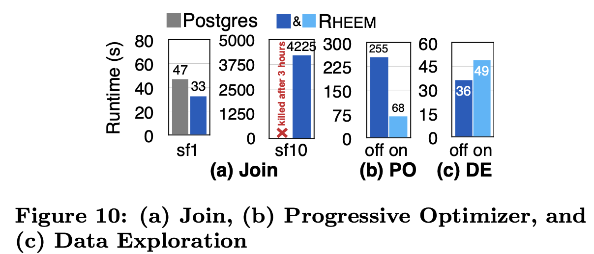

**Join**:
Compared Rheem with the execution of Join on Postgres (obvious platform to run this kind of queries). 
* Surprisingly, Rheem significantly outperforms Postgres, even though the input data is stored on Postgres.

Reason: 
* It executes the projection on Postgres and moves only the projected data into Spark to leverage its parallelism to perform the join and aggregation operations.

> Rheem is able to identify hidden opportunities to improve performance by using multiple platforms.

**Progressive optimizer**
Evaluate the effectiveness of the progressive optimizer (PO) by extending the Join task.

Reason:
* Rheem first generates an execution plan using Spark and JavaStreams.
  * It uses JavaStreams for all the operators after the Filter because it sees that Filter has a very high selectivity. 
* However, Rheem figures out that Filter is in fact low selective. Thus, it runs the re-optimization process and changes on-the-fly all JavaStreams operators to Spark operators. 
* This allows it to speed up performance by almost 4 times.

**Data Exploration**
Evaluate the cost that Rheem incurs in exploratory mode, where preliminary results are returned to users in less than 2 seconds and a task can be paused at and resumed from any part of its plan.

The executed task:
* Modify the WordCount task to compute how many words have less than 10 characters and equal or more than 10 characters.

Result:
* Rheem enables underlying platforms to run in exploratory mode at a low cost.

### Comparison with Musketeer
Comparing Rheem with the closest competitior Musketeer.

The Experiment considered the **CrocoPR**.
* This was the case where Musketeer chooses multiple platforms.

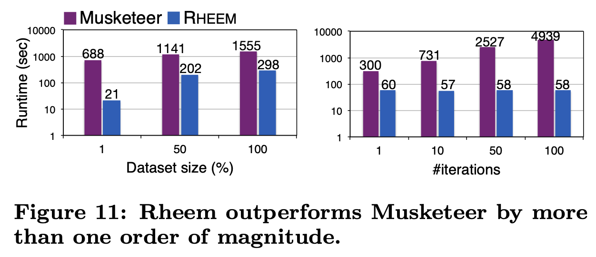

Rheem is up to 85 times faster than Musketeer.
Notice that in contrast to Musketeer, Rheem keeps its runtime constant as the number of iterations increases.

Reason:
1. Musketeer, among other things, checks dependencies, compiles and package the code, and writes the output to HDFS **at each iteration** (or stage), which comes with a high overhead.
2. Rheem executes the page rank part of the task (i.e., **after the data preparation**) on JavaStreams, which allows it to perform each iteration with almost zero overhead.

> Notice the log scale.

# Discussion

## Limitations
* Rheem does not support any stream processing platform.
* Relies on underlying platforms for fault-tolerance.
* Needs better inter-platform communication and resource manager integration.

## Lessons learned
* Extensibility must be first-class.
  * new platforms are constantly appearing
  * Must adapt to constant changes with little effort.
* Cost-based optimization is crucial (rules are too rigid).
* On-the-fly re-optimization is essential under uncertainty

# Related work
The research and industry communities have proposed a myriad of different data processing platforms:
* Apache HBase
* Apache Spark
* PostgreSQL
* VLDB
* PVLDB

In contrast Apache Wayang do not provide a data processing platform but a novel system on top of them.

Cross-platform data processing has been in the spotlight only very recently.
* Closest competitor to Rheem is **Musketeer**, but slower

Some platforms only focus on integration systems (e.g.,Apache Beam, Apache Drill, BigDAWG): limited platform awareness.
* They differ from Rheeem because
  * They consider neither data movement costs nor progressive task optimization techniques

Additionally, each of these works differs from Rheem in various ways.
* **Musketeer** maps task patterns to specific underlying platforms, hence it is not clear how one can efficiently map a task when having **similar platforms** (e.g., Spark vs. Flink or Postgres vs. MySQL).
* **Myria** it is hard to allocate tasks when having similar platforms because it comes with a **rule-based optimizer**, which additionally makes it hard to maintain.
* **IReS** supports only 1-to-1 mappings between abstract tasks and their implementations, which limits expressiveness and optimization opportunities.
* **QoX** ocuses only on ETL workloads.
* **DBMS+** is limited by the expressiveness of its declarative language and hence it is neither adaptive nor extensible.

> None of them address the cross-platform optimization problem.
> 
> Tensorflow follows a similar idea, but for cross-device execution of machine learning tasks and thus it is orthogonal to Rheem. 
> In fact, **Rheem could use TensorFlow as an underlying platform**.

To the best of their knowledge, Rheem is the first system to support all four cross-platform use cases.

# Conclusion
We have identified four different situations in which an application requires or benefits from cross-platform data processing.
* Platform independence
* Opportunistic Cross-Platform
* Mandatory Cross-Platform
* Polystore

Rheem is driven by theses cases, and is a cross-platform system that decouples applications from data processing platforms to achieve efficient task execution over multiple platforms.

Rheem follows a cost-based optimization approach for splitting an input task into subtasks and assigning each subtask to a specific platform (with minimized cost, in runtime or monetary cost).